# 1. Vue

## 1.1 什么是Vue

Vue是一套用于构建用户界面的渐进式JavaScript框架。与其它大型框架不同的是，Vue 被设计为可以自底向上逐层应用。Vue 的核心库只关注视图层，方便与第三方库或既有项目整合。

## 1.2 Vue  的好处

**轻量级框架**

只关注视图层,是一个构建数据的视图集合,大小只有几十kb

Vue.js通过简洁的API提供高效的数据绑定和灵活的组件系统

**简单易学**  

尤雨溪 --国人开发,中文文档,不存在语言障碍,易于理解和学习

**双向数据绑定**

也就是所谓的响应式数据绑定。这里的响应式不是@media 媒体查询中的响应式布局，而是指vue.js会自动对页面中某些数据的变化做出同步的响应。

也就是说，vue.js会自动响应数据的变化情况，并且根据用户在代码中预先写好的绑定关系，对所有绑定在一起的数据和视图内容都进行修改。而这种绑定关系，就是以input 标签的v-model属性来声明的，因此你在别的地方可能也会看到有人粗略的称vue.js为声明式渲染的模版引擎。

这也就是vue.js最大的优点，通过MVVM思想实现数据的双向绑定，让开发者不用再操作dom对象，有更多的时间去思考业务逻辑。

**组件化**

在前端应用，我们是否也可以像编程一样把模块封装呢？这就引入了组件化开发的思想。

Vue.js通过组件，把一个单页应用中的各种模块拆分到一个一个单独的组件（component）中，我们只要先在父级应用中写好各种组件标签（占坑），并且在组件标签中写好要传入组件的参数（就像给函数传入参数一样，这个参数叫做组件的属性），然后再分别写好各种组件的实现（填坑），然后整个应用就算做完了。

**视图,数据,结构分离**

使数据的更改更为简单,不需要进行逻辑代码的修改,只需要操作数据就能完成相关操作

**虚拟DOM**

现在的网速越来越快了，很多人家里都是几十甚至上百M的光纤，手机也是4G起步了，按道理一个网页才几百K，而且浏览器本身还会缓存很多资源文件，那么几十M的光纤为什么打开一个之前已经打开过，已经有缓存的页面还是感觉很慢呢？这就是因为浏览器本身处理DOM也是有性能瓶颈的，尤其是在传统开发中，用JQuery或者原生的JavaScript DOM操作函数对DOM进行频繁操作的时候，浏览器要不停的渲染新的DOM树，导致页面看起来非常卡顿。

而Virtual DOM则是虚拟DOM的英文，简单来说，他就是一种可以预先通过JavaScript进行各种计算，把最终的DOM操作计算出来并优化，由于这个DOM操作属于预处理操作，并没有真实的操作DOM，所以叫做虚拟DOM。最后在计算完毕才真正将DOM操作提交，将DOM操作变化反映到DOM树上。

**运行速度更快**

像比较与react而言,同样都是操作虚拟dom,就性能而言,vue存在很大的优势

## 1.3 三大前端框架

* Vue 
>
> 号称是最简单，最容易上手的框架，同时也是行内的大趋势，还可以用来开发最火的小程序。毕竟用这神器，代码码的飞快，项目也能快速上线。同时他也是双向数据流。有些人认为Vue是Angular和React的结合，既有Angular的模板语法也有React的组件化体系。
>
> 特点
>
> 基于MVVM开发模式
>
> 渐进式
>
> 数据驱动友好
>
> 组件化
>
> 轻量
>
> 简洁
>
> 快速
>
> 模块化友好

* React --Facebook的项目
>
> 这个框架本身比较容易理解，它的结构很清晰，就是由十几个API组成，然后异步渲染，我们只需要处理好接口和维护就好了，但是很多人反映上手还是有一定的的难度的。React是单向数据流，代码写起来会较双向数据流的多一些，但是同样的排查问题时思路清晰很多。
>
> 特点
>
> Virtual DOM
>
> 声明式设计
>
> 高效、灵活
>
> JSX
>
> 组件化
>
> 单向响应的数据流


* Angular--Google项目
>
> 大家眼里比较牛的框架，甚至有人说三大框架中只有它能称的上一个完整的框架，因为它包含的东西比较完善，包含模板，数据双向绑定，路由，模块化，服务，过滤器，依赖注入等所有功能。对于刚开始学习使用框架的小伙伴们，可以推荐这个框架，学会之后简直能颠覆之前你对前端开发的认知。使用 TypeScript能够提高代码可维护性，有利于后期重构。双向数据流很方便，但是等业务复杂之后，你可能就搞不清楚数据流了。还有令人不开心的脏值检查，以及directive的封装并没有解决视图与数据关系完全分离，有时候还要用$digist强制触发检测。
>
> 特点
>
> 基于 MVVM 开发模式
>
> Dependency Injection（依赖注入）
>
> TypeScript
>
> 模块化


## 1.4 框架和库的区别

框架是完整的技术解决方案，对项目的入侵较小，如果更换框架，那么就需要重新架构整个项目

库并不是完整的技术解决方案，只是单一的功能。如果某个库没法完成整个项目的需求，就可以切换库来完成需求

## 1.5 MVVM

MVVM 是视图层的概念，主要关注视图层的分离 。MVVM 把前端分层 三部分 Model View ViewModel

ViewModel 是核心，MVVM 提供了数据的双向绑定

# 2. 环境准备

## 2.1 技术的准备

html+css+javascript+jquery+ajax+bookstrap

## 2.2 工具的准备

node.js +webstorm 或者 vscode + webpack

vuedevtool

## 2.3 前端路线

* 开发工具的选择，选择适合自己的开发工具 webstrom ,visual code
* html
* css
* javascript
* jquery
* ajax 
* bookstrap
* node.js 
* angualar ,vue 框架 的使用--- 本章内容所讲
* 移动app 开发 React 


# 3. Vue 的入门


## 3.1 Vue 入门 讲解-

* 下载vue.js 

  ~~~
  https://cn.vuejs.org/v2/guide/installation.html
  ~~~

*  创建html

  ~~~html
  <!DOCTYPE html>
  <html lang="en">
  <head>
      <meta charset="UTF-8">
      <meta name="viewport" content="width=device-width, initial-scale=1.0">
      <title>Document</title>
      <!--  第一步引入 vue.js -->
      <script src="js/vue.js"></script>
  </head>
  <body>
      
      <div id="app">
  
          <p>hello,大家好我是joker</p>
          <h1>{{msg}}</h1>
      </div>
  <!-- 
      这里就是我们控制的 V
      <div id="app">
  
          <p>hello,大家好我是joker</p>
          <h1>{{msg}}</h1>
      </div> -->
  
  
      <!--  第二步 -->
      <!-- 创建Vue的 实例  -->
  
      <script>
  
  // vm 表示的是 VM
          var vm=new Vue({
              el:"#app" , // 表示当前 我们 new 的 这个Vue 实例需要控制那个 部分，#app 表示 控制  <div id="app"> 下面所有内容
              data:{ // data 属性中，存放的是 el 中需要用到是 数据
                  msg:"欢迎走进 Vue的 入门学习 ，joker  欢迎你",
              }
  
          });
      
  // Vue 中的data 属性表示的就是 Model 
  
      </script>
  
  </body>
  </html>
  ~~~

* 浏览html

  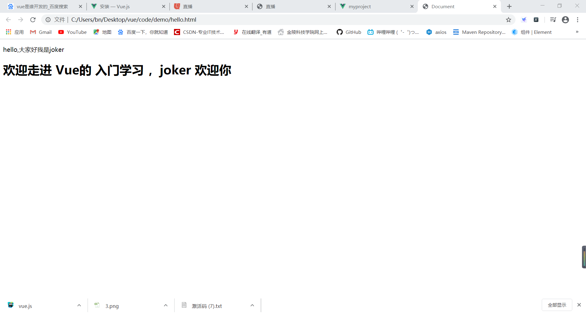


### Vue 的生命周期


生命周期说白了就是一堆方法


* 在beforeCreate之前的生命周期

  顾名思义，创建之前的阶段，此时该实例内的所有东西都还没有创建，所以在这个生命周期钩子函数中$el,data都是undefined。

*  在beforeCreate和created钩子函数之间的生命周期。

   在这个生命周期之间，进行初始化事件，进行数据的观测，在created的时候数据已经和data属性进行绑定，在这个生命周期钩子函数中，我们可以获取到data的值并对它进行操作。
   
* beforeMount间的生命周期
  在这一阶段，首先会判断是否有el选项，如果有的话就继续向下编译，如果没有el选项，则停止编译，也就意味着停止了生命周期，直到在该实例上调用vm.$mount(el)[也就是动态引入了el。
  除了el，我们还会用到template，template对生命周期的影响如下：
> 如果如果vue实例对象中有template参数选项，则将其作为模板编译成render函数
> 如果没有template选项，则将外部html作为模板编译（可参考上面示例的结果）
> template中的模板优先级要高于outer html的优先级

* mounted钩子
  此时是给vue实例对象添加$el成员，并且替换掉挂载的DOM元。
  可以看到图中beforeMount钩子函数中挂载元素中还是{{message}}，到mounted钩子函数中的时候挂载已完成，所以挂载元素中显示的是message的值

* beforeUpdate钩子函数
  当vue发现data中的数据发生变化，会触发对对应组件的重新渲染，当数据改变后调用beforeupdata，当渲染完成后调用updated钩子函数。
> 注：通过试验证明，在mounted钩子函数中执行修改data的操作会触发beforeUpdate，而它之前的函数中只要不是可以跳出主线程的数据操作，都不会触发beforeUpdate。例如使用setTimeout会使其中代码跳出主线程到异步线程中，所以它的执行会在mounted之后，所以会触发beforeUpdate。


* beforeDestroy
  beforeDestroy钩子函数在实例销毁之前调用。在这一步实例仍然可用。destroyed钩子函数在Vue 实例销毁后调用。调用后，Vue 实例指示的所有东西都会解绑定，所有的事件监听器会被移除，所有的子实例也会被销毁。


**样例**

~~~html
<!--<!DOCTYPE html>-->
<!--<html lang="en">-->

<!--<head>-->
<!--    <meta charset="UTF-8">-->
<!--    <meta name="viewport" content="width=device-width, initial-scale=1.0">-->
<!--    <title>Document</title>-->
<!--    &lt;!&ndash;  第一步引入 vue.js &ndash;&gt;-->
<!--    <script src="js/vue.js"></script>-->


<!--</head>-->

<!--<body>-->
<!--    &lt;!&ndash; HTML &ndash;&gt;-->
<!--    <div id="app">-->
<!--        <p>{{msg}}</p>-->
<!--        <p>{{date}}</p>-->
<!--    </div>-->

<!--    <script>-->


<!--        var vm = new Vue({-->
<!--            el: "#app",-->
<!--            data: {-->
<!--                flag: true,-->
<!--                msg: "大家好",-->
<!--                date:new Date()-->
<!--            },-->

<!--            beforeCreate(){-->
<!--                // 第一个生命周期，表示生命周期被创建出来之前，会执行他,此时数据是没有的-->
<!--                console.log("beforeCreate &ndash;&gt;"+this.flag)-->
<!--            },-->
<!--            created: function(){-->
<!--                // 第二个生命周期，这个时候能够是有 data 和 methods 中的数据和方法。-->
<!--                console.log("create-&#45;&#45;date&ndash;&gt;"+this.date)-->
<!--            },-->
<!--            beforeMount(){-->
<!--                // 第三个生命周期，这个是-->
<!--            },-->
<!--            mounted:function () {-->
<!--                console.log("before &ndash;&gt;> msg &ndash;&gt;"+this.msg)-->
<!--            },-->


<!--        });-->


<!--    </script>-->

<!--</body>-->

<!--</html>-->

<!DOCTYPE html>
<html lang="en">
<head>
    <meta charset="UTF-8">
    <meta name="viewport" content="width=device-width, initial-scale=1.0">
    <meta http-equiv="X-UA-Compatible" content="ie=edge">
    <title>vue生命周期学习</title>
    <script src="https://cdn.bootcss.com/vue/2.5.16/vue.js"></script>
</head>
<body>
<div id="app">
    <h1>{{message}}，这是在outerHtml中</h1>
</div>
</body>
<script>
    var app = new Vue({
        el: '#app',
        data: {
            message: 10
        },
        beforeCreate: function() {
            console.group('------beforeCreate创建前状态------');
            console.log("%c%s", "color:red" , "el     : " + this.$el);
            console.log("%c%s", "color:red","data   : " + this.$data);
            console.log("%c%s", "color:red","message: " + this.message)
        },
        created: function() {
            console.group('------created创建完毕状态------');
            console.log("%c%s", "color:red","el     : " + this.$el);
            console.log("%c%s", "color:red","data   : " + this.$data);
            console.log("%c%s", "color:red","message: " + this.message);
        },
        beforeMount: function() {
            console.group('------beforeMount挂载前状态------');
            console.log("%c%s", "color:red","el     : " + (this.$el));
            console.log(this.$el);
            console.log("%c%s", "color:red","data   : " + this.$data);
            console.log("%c%s", "color:red","message: " + this.message);
        },
        mounted: function() {
            console.group('------mounted 挂载结束状态------');
            console.log("%c%s", "color:red","el     : " + this.$el);
            console.log(this.$el);
            console.log("%c%s", "color:red","data   : " + this.$data);
            console.log("%c%s", "color:red","message: " + this.message);
        },
        beforeUpdate: function () {
            console.group('beforeUpdate 更新前状态===============》');
            console.log("%c%s", "color:red","el     : " + this.$el);
            console.log(this.$el);
            console.log("%c%s", "color:red","data   : " + this.$data);
            console.log("%c%s", "color:red","message: " + this.message);
        },
        updated: function () {
            console.group('updated 更新完成状态===============》');
            console.log("%c%s", "color:red","el     : " + this.$el);
            console.log(this.$el);
            console.log("%c%s", "color:red","data   : " + this.$data);
            console.log("%c%s", "color:red","message: " + this.message);
        },
        beforeDestroy: function () {
            console.group('beforeDestroy 销毁前状态===============》');
            console.log("%c%s", "color:red","el     : " + this.$el);
            console.log(this.$el);
            console.log("%c%s", "color:red","data   : " + this.$data);
            console.log("%c%s", "color:red","message: " + this.message);
        },
        destroyed: function () {
            console.group('destroyed 销毁完成状态===============》');
            console.log("%c%s", "color:red","el     : " + this.$el);
            console.log(this.$el);
            console.log("%c%s", "color:red","data   : " + this.$data);
            console.log("%c%s", "color:red","message: " + this.message)
        }
    })
</script>
</html>
~~~


## 3.2 Vue 的基础语法

### 3.2.1 赋值语法

* v-clock  --插值表达式
* v-text
* v-html

~~~html
<!DOCTYPE html>
<html lang="en">
<head>
    <meta charset="UTF-8">
    <meta name="viewport" content="width=device-width, initial-scale=1.0">
    <title>Document</title>
    <!--  第一步引入 vue.js -->
    <script src="js/vue.js"></script>
    <style>
        [v-clock]{
            display: none;
        }
    </style>
</head>
<body>
    
    <div id="app">
        <h1  v-clock>++++++{{msg}}-----</h1>
        <p v-text="name"></p>
        <p v-text="age"></p>
        <p v-html="v"></p>
    </div>


    <!--  第二步 -->
    <!-- 创建Vue的 实例  -->

    <script>

// vm 表示的是 VM
        var vm=new Vue({
            el:"#app" , 
            data:{ 
                msg:"v_clock 属性", // v-clock 能够解决 插值表达式的闪烁问题，在网速较慢情况下 ，没有加载到数据时，显示的会是++++++{{msg}}-----，不是++++++v_clock 属性-----
                name:"joker",// 直接赋值
                age:"<h1> 133 v-text -age</h1>", // v-text  不能够显示 html 内容 
                v:"<h1>v-html大家好</h1>" // v-html  能够渲染 html 信息

            }

        });
    
// Vue 中的data 属性表示的就是 Model 

    </script>

</body>
</html>
~~~


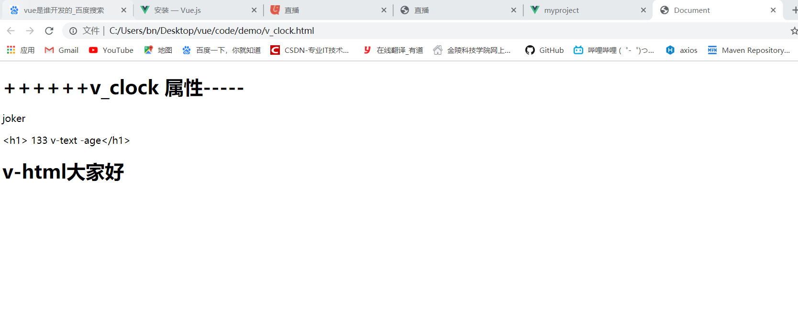

### 3.2.2 绑定属性

* v-bind

~~~html
<!DOCTYPE html>
<html lang="en">
<head>
    <meta charset="UTF-8">
    <meta name="viewport" content="width=device-width, initial-scale=1.0">
    <title>Document</title>
    <!--  第一步引入 vue.js -->
    <script src="js/vue.js"></script>

</head>
<body>
    
    <div id="app">
        <!--  v-bind  是vue 提供的用于绑定 属性的 指令 -->
      <input type="button" value="v-bind 测试" v-bind:title="mytitle">
      <br>
      <br>
      <input type="button" value="v-bind 测试" title="mytitle">
      <br>
      <br>
      <!-- v-bind 会把后面的 东西当作一个js  -->
       <input type="button" value="v-bind 测试" v-bind:title="mytitle+'1234'">
      <br>
      <br>
      <!-- v-bind 可以被简写为一个冒号加上一个 属性 :title   -->
      <input type="button" value="v-bind 测试" :title="mytitle+'1234'">
      <br>
      <br>
    </div>

    <!--  第二步 -->
    <!-- 创建Vue的 实例  -->

    <script>

        var vm=new Vue({
            el:"#app" , 
            data:{ 
            mytitle:"这个是自己定义的title"
            }

        });
    

    </script>

</body>
</html>
~~~


### 3.2.3 表单绑定


v-model 实现的双向绑定

~~~html
<!DOCTYPE html>
<html lang="en">

<head>
    <meta charset="UTF-8">
    <meta name="viewport" content="width=device-width, initial-scale=1.0">
    <title>Document</title>
    <!--  第一步引入 vue.js -->
    <script src="js/vue.js"></script>

</head>

<body>


    <div id="app">
        <h1>{{msg}}</h1>
        <h1>{{result}}</h1>
        <!--  v-bind 只能实现数据的单向绑定 -->
        <input type="text" v-bind:value="msg" style="width:100px"><br>
        <!-- v-model  能够实现双向绑定 -->
        <input type="text" v-model="msg" style="width:100px"><br>

        <input type="text" v-model="result" style="width:100px"><br>

        <!-- 还能绑定 -->
        <input type="checkbox" v-model="flag">
        <div>flag---{{flag}}</div><br>
        <!-- name相同 表示的是 一组 -->
        <input type="radio" v-model="istrue" value="man" name="sex">
        <input type="radio" v-model="istrue" value="women" name="sex">
        <div>istrue----{{istrue}}</div>

    </div>


        <script>

            var vm = new Vue({
                el: "#app",
                data: {
                    msg: "数据",
                    result: "1",
                    flag:true,
                    istrue:"man"
                },

            });


        </script>

</body>

</html>
~~~


### 3.2.4 事件监听

* v-on

  ~~~html
  <!DOCTYPE html>
  <html lang="en">
  <head>
      <meta charset="UTF-8">
      <meta name="viewport" content="width=device-width, initial-scale=1.0">
      <title>Document</title>
      <!--  第一步引入 vue.js -->
      <script src="js/vue.js"></script>
  
  </head>
  <body>
      
      <!--  这个部分不能 被 vue 所管辖的范围 ，不然事件不会成功 -->
      <input id="but" type="button" value="事件监听 document">
      <br>
  
      <div id="app">
          <br>
        <input id="v-on" type="button" value="事件监听 ，vue" v-on:click="show">
        <input id="v-on" type="button" value="事件监听 ，vue@ 写法" @click="show">
      </div>
  
      <!--  第二步 -->
      <!-- 创建Vue的 实例  -->
  
      <script>
  
          document.getElementById("but").onclick=function (){
              alert("点击了事件监听 document ");
          };
  
          var vm=new Vue({
              el:"#app" , 
              data:{ 
            
              },
              methods:{ // 在method 中定义方法事件
  
                  show:function(){
                      alert("点击了 事件监听 ，vue")
                  }
  
              }
  
  
          });
      
  
      </script>
  
  </body>
  </html>
  ~~~

  

* 事件修饰符

     正常情况下点击点击 子元素 ，事件会冒泡被 父元素事件

  - **`.stop`**：等同于JavaScript中的`event.stopPropagation()`，防止事件冒泡
  - **`.prevent`**：等同于JavaScript中的`event.preventDefault()`，防止执行预设的行为（如果事件可取消，则取消该事件，而不停止事件的进一步传播）
  - **`.capture`**：与事件冒泡的方向相反，事件捕获由外到内
  - **`.self`**：只会触发自己范围内的事件，不包含子元素
  - **`.once`**：只会触发一次

  ~~~html
  <!DOCTYPE html>
  <html lang="en">
  
  <head>
      <meta charset="UTF-8">
      <meta name="viewport" content="width=device-width, initial-scale=1.0">
      <title>Document</title>
      <!--  第一步引入 vue.js -->
      <script src="js/vue.js"></script>
  
  </head>
  
  <body>
      <!-- HTML -->
      <div id="app">
          　　<div class="outer" @click="outer">
              　　　　<div class="middle" @click="middle">
                  　 <button @click.stop="inner">点击我(^_^) stop 停止冒泡</button>
                  <button @click="inner">点击我 啥都不加</button><br>
                  <a href="https://www.baidu.com" @click.prevent="inner">有问题去找百度</a><br>
                  <button @click.prevent="inner">点击我(^_^)</button>
                  <button @click.capture="inner">点击我(^_^) capture</button>
                  <button @click.once="inner">点击我(^_^) once</button>
                  <button @click.self="inner">点击我(^_^) self</button>
              　</div>
          </div>
      </div>
      <style>
          .outer {
              background-color: #74cf59;
              height: 400px;
              width: 400px;
          }
  
          .middle {
              background-color: #78a5f1;
              height: 200px;
              width: 200px;
          }
      </style>
  
      <script>
  
          var vm = new Vue({
              el: "#app",
              data: {
  
              },
              methods: { // 在method 中定义方法事件
                  outer() {
                      console.log("outer 最外层")
                  },
                  inner() {
                      console.log(" inner 最里面")
                  },
                  middle() {
                      console.log("middle 中间")
                  }
              }
          });
      </script>
  
  </body>
  
  </html>
  ~~~

  

* 系统修饰符

  ~~~
  <!DOCTYPE html>
  <html lang="en">
  
  <head>
      <meta charset="UTF-8">
      <meta name="viewport" content="width=device-width, initial-scale=1.0">
      <title>Document</title>
      <!--  第一步引入 vue.js -->
      <script src="js/vue.js"></script>
      <style>
          .height {
              height: 150px;
          }
  
          .red {
              background-color: red;
              color: blue;
              font-style: italic;
          }
      </style>
  
  </head>
  
  <body>
  
      <!--  这个部分不能 被 vue 所管辖的范围 ，不然事件不会成功 -->
      <input id="but" type="button" value="事件监听 document">
      <br>
  
      <div id="app">
          <br>
          <input id="v-on" type="button" value="事件监听 ，vue" v-on:click="show"><br>
  
          <input id="v" type="button" value="事件监听 ，vue@ 写法" @click="show"><br>
          <!--  按键 -->
          <input id="v-text" type="text" value="" @keyup="keyup($event)"><br>
  
          <!-- 按键修饰符 -->
          <input id="v-text1" type="text" value="" @keyup.enter="keyup_enter($event)">
  
          <!-- 系统修饰符 -->
          <!-- 可以用如下修饰符来实现仅在按下相应按键时才触发鼠标或键盘事件的监听器。 -->
          <!-- click +ctrl  --> 
          <!-- 点击鼠标+按下 ctrl 键 才能触动事件 -->
          <div @click.ctrl="doSomething"class="red height">Do something</div>
  
      </div>
  
      <!--  第二步 -->
      <!-- 创建Vue的 实例  -->
  
      <script>
  
          document.getElementById("but").onclick = function () {
              alert("点击了事件监听 document ");
          };
  
          var vm = new Vue({
              el: "#app",
              data: {
  
              },
              methods: { // 在method 中定义方法事件
  
                  show: function () {
                      alert("点击了 事件监听 ，vue")
                  },
                  keyup(event) {
                      console.log(event.key + "  点击了键盘");
                      // console.log(event.data+"进行的回车时间");
                  },
                  keyup_enter(data) {
                      console.log("按键修饰符,你点击了回车键 " + data.key)
                  },
                  doSomething() {
                      console.log("做了一些事情")
                  }
  
              }
  
  
          });
  
  
      </script>
  
  </body>
  
  </html>
  ~~~

  

  


### 3.2.5 条件和循环

循环 `v-for`

~~~html
<!DOCTYPE html>
<html lang="en">

<head>
    <meta charset="UTF-8">
    <meta name="viewport" content="width=device-width, initial-scale=1.0">
    <title>Document</title>
    <!--  第一步引入 vue.js -->
    <script src="js/vue.js"></script>


</head>

<body>
    <!-- HTML -->
    <div id="app">
        <a v-for="item in list">{{item}} </a>
        <br>

        <!-- 索引值 -->
        <a v-for="(item,i) in list">{{item}}---{{i}} </a>
        <!--  这是数组对象 -->
        <p v-for="item in listdata">{{item.id}}---{{item.name}}</p>
        <!-- 对象 -->
        <p v-for="(val,key) in user">{{val}}---{{key}}</p>

        <!-- 还有第三个对象索引  -->
        <p v-for="(val,key,m) in user">{{val}}---{{key}}--{{m}}</p>

        <!-- 迭代数组 打印99 乘法表 -->

        <p v-for="count in 9">
            <a href="https://www.baidu.com" v-for="item in count">
                {{count}}*{{item}}={{count*item}}
            </a>
        </p>

    </div>

    <script>

        var vm = new Vue({
            el: "#app",
            data: {
                list: [16, 2, 14, 5, 6, 7, 82222, 423],
                listdata: [
                    {
                        id: 1,
                        name: "joker"
                    },
                    {
                        id: 2,
                        name: "peter"
                    }
                ],
                user: {
                    id: 12819,
                    name: "kk",
                    age: 13
                }
            },
            methods: { // 在method 中定义方法事件

            }
        });
    </script>

</body>

</html>
~~~


条件 v-if v-show v-else v-else-if

~~~html
<!DOCTYPE html>
<html lang="en">

<head>
    <meta charset="UTF-8">
    <meta name="viewport" content="width=device-width, initial-scale=1.0">
    <title>Document</title>
    <!--  第一步引入 vue.js -->
    <script src="js/vue.js"></script>


</head>

<body>
    <!-- HTML -->
    <div id="app">
        <input type="button" @click="show" width="100px"value="切换">
       <p v-if="flag">这是v-if 控制的元素</p>
       <p v-else>这个是 v-else 控制的元素</p>

       <p v-show="flag">这是 v-show 控制的元素</p>

       <!--  还有一个v-else-if 的元素 -->
    </div>

    <script>

        var vm = new Vue({
            el: "#app",
            data: {
                flag:true
            },
            methods: { // 在method 中定义方法事件

            show(){
               this.flag= this.flag?false:true;
            }
            }
        });
    </script>

</body>

</html>
~~~


### 3.2.6 计算属性

~~~
<!DOCTYPE html>
<html lang="en">

<head>
    <meta charset="UTF-8">
    <meta name="viewport" content="width=device-width, initial-scale=1.0">
    <title>Document</title>
    <!--  第一步引入 vue.js -->
    <script src="js/vue.js"></script>

</head>

<body>

    <div id="app">
        <input type="number" v-model:value="a">

        <p>结果为-----{{jisuan}}</p>  
        <p>结果为-----{{jisuan1()}}</p>

        <!-- 第二种写法 -->
        <p>com 结果为{{com}}</p>

        <input type="number" v-model="b">
        
        <!-- watch 的监听事件 ，类似于 v-model -->
        <p> b_jisuan  的结果为{{b_jisuan}}</p>

    </div>

    <script>

        var vm = new Vue({
            el: "#app",
            data: {
                mytitle: "这个是自己定义的title",
                a: 0,
                b:10
            },
            computed: {
                //  这个是 有缓存的
                jisuan() {
                    console.log("computed")
                    return this.a * this.a;
                },
                //  方法的第二种写法
                com:{
                    get(){
                        console.log("这个是 get 方法")
                        return this.a-1;
                    },
                    // 如何调用呢 ，按下F12 然后在控制台输入 vm.com=10，就会调用 set 方法
                    set(data){
                        this.a=data;
                    }
                },

                b_jisuan(){
                    console.log("调用了 b_jushuan")
                    return this.b*this.b;
                }

            },
            methods:{
                jisuan1() {
                    // console.log("methods")
                    //  这个是没有缓存的
                    return this.a * this.a;
                }
            },
            //  这个是事件的监听
            watch:{
                b(newQuestion, oldQuestion){
                    console.log("b 的数据变化了"+newQuestion);
                    // this.b_jisuan();

                }
            }

        });


    </script>

</body>

</html>
~~~


### 3.2.7 过滤器

过滤器可以用在差值表达式中和 v-bind 中，用来格式化输出

>错误示范  [Vue warn]: Failed to resolve filter: msgformat
>
>~~~js
>
>        var vm = new Vue({
>            el: "#app",
>            data: {
>                flag:true,
>                msg:"大家好"
>            },
>            methods: { // 在method 中定义方法事件
>
>            show(){
>               this.flag= this.flag?false:true;
>            }
>            }
>        });
>
>//  过滤器的第一个参数为过滤器的名称 ，第二个参数为 要进行的方法
>        Vue.filter('msgformat',function(data){
>
>            return data+"1213";
>        })
>~~~
>
>把 Vue 过滤器 写在了下面
>
>#### 过滤器应该先执行，写在上面，再绑定vue实例


正确示范

~~~html
<!DOCTYPE html>
<html lang="en">

<head>
    <meta charset="UTF-8">
    <meta name="viewport" content="width=device-width, initial-scale=1.0">
    <title>Document</title>
    <!--  第一步引入 vue.js -->
    <script src="js/vue.js"></script>


</head>

<body>
    <!-- HTML -->
    <div id="app">
        <p>{{msg | msgformat}}</p>
        <p>{{date |dateformate}}</p>

    </div>

    <script>

        //  全局过滤器的作用 ，就是全部的 new Vue()都是可以用的
        //第一个参数为过滤器的名称 ，第二个参数为 要进行的方法
        Vue.filter('msgformat', function (data) {

            return data + "1213";
        })

        var vm = new Vue({
            el: "#app",
            data: {
                flag: true,
                msg: "大家好",
                date:new Date()
            },
            methods: { // 在method 中定义方法事件

                show() {
                    this.flag = this.flag ? false : true;
                }
            },
            // 注意点，过滤器调用是，采用 就近原则，如果私有过滤器 和全局过滤器名字一样，使用私有过滤器的名字
            filters:{ // 定义私有过滤器，仅仅能够自己使用
                dateformate(data){
                    var newdata=new Date(data);
                    var year=newdata.getFullYear();
                    var month =newdata.getMonth()+1;
                    console.log(year)
                    console.log(month)

                    //  ` ` 是ES6  中新增的模板字符串
                    return `${year}-${month}`;
                }
            }
        });


    </script>

</body>

</html>
~~~


### 3.2.8 样式 class,style

* class

  ~~~html
  <!DOCTYPE html>
  <html lang="en">
  
  <head>
      <meta charset="UTF-8">
      <meta name="viewport" content="width=device-width, initial-scale=1.0">
      <title>Document</title>
      <!--  第一步引入 vue.js -->
      <script src="js/vue.js"></script>
      <style>
          .height{
              height: 150px;
          }
          .red{
              color:red;
              font-style: italic;
          }
          .blue{
              color: royalblue;
              letter-spacing: 1em;
          }
      </style>
  
  </head>
  
  <body>
      <!-- HTML -->
      <div id="app">
          <h1 class="height red">这个是用来测试 vue 的样式</h1>
          <h1 :class="['height','red']">这个是用来测试 vue 的样式</h1>
          <!--  三目表达式使用 -->
          <h1 :class="['red',flag?'blue':'']">这个是用来测试 vue 的样式</h1>
          <h1 :class="['red',{'blue':flag}]">这个是用来测试 vue 的样式</h1>
          <h1 :class="{red:true,blue:flag}">这个是用来测试 vue 的样式</h1>
          <h1 :class="classobj">这个是用来测试 vue 的样式</h1>
      </div>
    
      <script>
  
          var vm = new Vue({
              el: "#app",
              data: {
                  flag:true,
                  classobj:{red:true,blue:true}
              },
              methods: { // 在method 中定义方法事件
                
              }
          });
      </script>
  
  </body>
  
  </html>
  ~~~

* style 内联样式

  ~~~html
  <!DOCTYPE html>
  <html lang="en">
  
  <head>
      <meta charset="UTF-8">
      <meta name="viewport" content="width=device-width, initial-scale=1.0">
      <title>Document</title>
      <!--  第一步引入 vue.js -->
      <script src="js/vue.js"></script>
      <style>
          .height {
              height: 150px;
          }
  
          .red {
              color: red;
              font-style: italic;
          }
  
          .blue {
              color: royalblue;
              letter-spacing: 1em;
          }
      </style>
  
  </head>
  
  <body>
      <!-- HTML -->
      <div id="app">
          <!--  属性后面必须加上  单引号 -->
          <h1 :style="{color:'red','font-style':'italic'}">这是内联样式操作</h1>
          <h1 :style="styleobj">这是内联样式操作</h1>
          <!-- 样式v可以存放数组 -->
          <h1 :style="[styleobj,styleobj2]">这是内联样式操作</h1>
      </div>
  
      <script>
  
          var vm = new Vue({
              el: "#app",
              data: {
                  flag: true,
                  styleobj: {color:'red','font-style':'italic'},
                  styleobj2:{"font-weight":500}
              },
              methods: { // 在method 中定义方法事件
  
              }
          });
      </script>
  
  </body>
  
  </html>
  ~~~

  

### 3.2.9 自定义组件

- `bind`：只调用一次，指令第一次绑定到元素时调用。在这里可以进行一次性的初始化设置。
- `inserted`：被绑定元素插入父节点时调用 (仅保证父节点存在，但不一定已被插入文档中)。
- `update`：所在组件的 VNode 更新时调用，**但是可能发生在其子 VNode 更新之前**。指令的值可能发生了改变，也可能没有。但是你可以通过比较更新前后的值来忽略不必要的模板更新 (详细的钩子函数参数见下)。

- `componentUpdated`：指令所在组件的 VNode **及其子 VNode** 全部更新后调用。
- `unbind`：只调用一次，指令与元素解绑时调用。


方法中参数解释

- `el`：指令所绑定的元素，可以用来直接操作 DOM 。

- `binding`

  ：一个对象，包含以下属性：

  - `name`：指令名，不包括 `v-` 前缀。
  - `value`：指令的绑定值，例如：`v-my-directive="1 + 1"` 中，绑定值为 `2`。
  - `oldValue`：指令绑定的前一个值，仅在 `update` 和 `componentUpdated` 钩子中可用。无论值是否改变都可用。
  - `expression`：字符串形式的指令表达式。例如 `v-my-directive="1 + 1"` 中，表达式为 `"1 + 1"`。
  - `arg`：传给指令的参数，可选。例如 `v-my-directive:foo` 中，参数为 `"foo"`。
  - `modifiers`：一个包含修饰符的对象。例如：`v-my-directive.foo.bar` 中，修饰符对象为 `{ foo: true, bar: true }`。

- `vnode`：Vue 编译生成的虚拟节点。

- `oldVnode`：上一个虚拟节点，仅在 `update` 和 `componentUpdated` 钩子中可用。


~~~html
<!DOCTYPE html>
<html lang="en">

<head>
    <meta charset="UTF-8">
    <meta name="viewport" content="width=device-width, initial-scale=1.0">
    <title>Document</title>
    <!--  第一步引入 vue.js -->
    <script src="js/vue.js"></script>
    <style>
        .height {
            height: 150px;
        }

        .red {
            color: red;
            font-style: italic;
        }

        .blue {
            color: royalblue;
            letter-spacing: 1em;
        }
    </style>

</head>

<body>


<div id="app">
    <input type="text" v-focus>
    <!--         参数在 双引号里面 ，一个单引号 对应参数-->
    <p v-color="'blue'">全局的 自定义标签</p>

    <p v-owns> 私有 的自定义 标签</p>
    <p v-owns1> 私有 的自定义 标签--钩子快速写法</p>
</div>

<script>


    <!--自定义的关于自动聚焦的方法-->
    Vue.directive("focus", {

        //
        bind: function (el) { // 每当指令绑定要元素上的时候，就会立刻执行 这个 bind  元素，但是只执行一次
            // 这个时候 元素还没有插入到 dom 元素的时候，el.focus()是没有效果的
            // el.focus();
        },
        inserted: function (el) { // 元素插入到dom 元素的时候
            el.focus()
        },
        update: function () {

        }

    });

    // 自定义关于颜色
    Vue.directive("color", {

        // 一个页面渲染过程
        // 数据-------->  内存 --------> 页面
        //  bind 过程
        // 数据 -> bind --内存--insert-->页面

        bind: function (el) { // 和样式相关的属性一般都在 bind
            el.style.color = 'red'
        },
        inserted: function (el, binding, vNode) { //和 js 有关的都在 inserted 的里面
            el.focus()
            console.log(binding.name)
            console.log(binding.value)
            el.style.color = binding.value;
        },
        update: function () {

        }

    });


    var vm = new Vue({
        el: "#app",
        data: {},
        methods: { // 在method 中定义方法事件

        },
        // 自定义 私有 的
        directives:{
            "owns":{
                bind(el){
                  el.style.color='red'
                },
                inserted(el,binding){
                    el.style.fontSize="50px"
                }
            },
            // 还有一种用钩子函数快速的写法
            "owns1":function (el,binding) {
                el.style.color='green';
                el.style.fontSize="50px"
            }
        }

    });


</script>

</body>

</html>
~~~


### 3.2.10 效果展示

* 跑马灯

~~~html
<!DOCTYPE html>
<html lang="en">

<head>
    <meta charset="UTF-8">
    <meta name="viewport" content="width=device-width, initial-scale=1.0">
    <title>Document</title>
    <!--  第一步引入 vue.js -->
    <script src="js/vue.js"></script>

</head>

<body>

    <!-- 跑马灯 事件 -->
    <!--定义两个事件  -->
    <!-- 第一个事件每隔一段事件就进行字符串的操作-->
    <!-- 第二个事件就是让 定时事件停止 -->

    <div id="app">
        <input type="button" @click="dong" value="动起来">
        <input type="button" @click="stop" value="别动">

        <h1>{{msg}}</h1>
        <h1 :value="msg"></h1>
    </div>


    <script>stop

        var vm = new Vue({
            el: "#app",
            data: {
                msg: "别浪!! 猥琐发育",
                flag: null // 表示是否在运动 

            },
            methods: { // 在method 中定义看素偶哟

                dong() {
                    // 只有这个事件没有启动了,才能来 启动
                    if(this.flag!=null) return;

                    //  这里使用 lamber 表达式 ,400 毫秒 刷新一次
                    this.flag = setInterval(() => {

                        var start = this.msg.substring(0, 1);// 获取第一个字符串
                        var end = this.msg.substring(1);// 获取剩下是 字符串
                        this.msg = end + start;// 进行拼接
                        // vue 会自己监听 自己data 中数据的变化
                        // 不需要程序员自己来进行重新复制

                    }, 400);

                },
                stop() {
                    //  只有这个事件已经 启动,才能进行清楚
                    if(this.flag!=null){
                        clearInterval(this.flag);
                        // 每当清楚 定时器,就重新赋值
                        this.flag=null;
                    }

                }

            }


        });


    </script>

</body>

</html>
~~~


## 3.3 Vue 的组件化开发

### 3.3.1 注册组件

组件的开发就是为了拆分Vue 的实例代码，能够让我们以不同的组件，来划分不同的功能模块.

模块化：从代码的逻辑角度划分的

组件化: 从UI 界面的角度划分的

#### 全局组件

* 写法一 ：Vue.extend()

~~~html
<!DOCTYPE html>
<html lang="en">
<head>
    <meta charset="UTF-8">
    <meta name="viewport" content="width=device-width, initial-scale=1.0">
    <title>Document</title>
    <!--  第一步引入 vue.js -->
    <script src="js/vue.js"></script>
</head>
<body>

<div id="app">

    <p>hello,大家好我是joker</p>
    <h1>{{msg}}</h1>

<!--    组件在使用时，直接当做标签使用即可-->
    <mycom></mycom>
    <my-com></my-com>
</div>


<script>

    // 组价化开发，创建组件模板对象
    var com1 = Vue.extend({
        template: "<h1>这个是Vue。extend 开发的组件</h1>"
    })

    // Vue.component("组件名","创建出来的组件模板对象);
    Vue.component("mycom", com1);

    // 如果使用驼峰命名的方法，那么在应用的时候，就需要加上 -
    Vue.component("myCom", com1);


    // vm 表示的是 VM
    var vm = new Vue({
        el: "#app", // 表示当前 我们 new 的 这个Vue 实例需要控制那个 部分，#app 表示 控制  <div id="app"> 下面所有内容
        data: { // data 属性中，存放的是 el 中需要用到是 数据
            msg: "欢迎走进 Vue的 入门学习 ，joker  欢迎你",
        }

    });


</script>

</body>
</html>
~~~


* 写法二：用 template 语法
~~~
<!DOCTYPE html>
<html lang="en">
<head>
    <meta charset="UTF-8">
    <meta name="viewport" content="width=device-width, initial-scale=1.0">
    <title>Document</title>
    <!--  第一步引入 vue.js -->
    <script src="js/vue.js"></script>
</head>
<body>

<div id="app">

<!--    组件在使用时，直接当做标签使用即可-->
    <my-com></my-com>
    <my-com2></my-com2>
</div>

<!--这个模板一定要在 Vue 控制 的外面-->
<template id="kk">
    <div >
        <h1>这个是template id="kk"直接使用模板开发出来的的</h1>
    </div>
</template>

<script>

    // 第二种使用 全局定义的
    Vue.component("myCom",{
        template: "<h1>这个是componemt 直接使用模板开发出来的的</h1>"
    })

    // 下面这样子的会报错，因为模板只能有一个根元素 ，不能 有两个或者更多
    // Vue.component("myCom",{
    //     template: "<h1>这个是componemt 直接使用模板开发出来的的</h1><span>123</span>"
    // })

    // 第三种使用的
    Vue.component("myCom2",{
        template: "#kk"
    })

    // vm 表示的是 VM
    var vm = new Vue({
        el: "#app", // 组件化开发_1.html表示当前 我们 new 的 这个Vue 实例需要控制那个 部分，#app 表示 控制  <div id="app"> 下面所有内容
        data: { // data 属性中，存放的是 el 中需要用到是 数据
            msg: "欢迎走进 Vue的 入门学习 ，joker  欢迎你",
        }

    });


</script>

</body>
</html>
~~~


#### 局部组件--components属性

~~~html
<!DOCTYPE html>
<html lang="en">
<head>
    <meta charset="UTF-8">
    <meta name="viewport" content="width=device-width, initial-scale=1.0">
    <title>Document</title>
    <!--  第一步引入 vue.js -->
    <script src="js/vue.js"></script>
</head>
<body>

<div id="app">

    <p>hello,大家好我是joker</p>
    <login></login>
</div>


<script>


    // vm 表示的是 VM
    var vm = new Vue({
        el: "#app", // 组件化开发_1.html表示当前 我们 new 的 这个Vue 实例需要控制那个 部分，#app 表示 控制  <div id="app"> 下面所有内容
        data: { // data 属性中，存放的是 el 中需要用到是 数据
            msg: "欢迎走进 Vue的 入门学习 ，joker  欢迎你",
        },
        components:{
            login:{
                template:"<h1>这个是自定义的私有属性的组件化</h1> "
            }
        }

    });


</script>

</body>
</html>
~~~


#### 组件的data 和methods

> 组价中的data 必须是 方法 ，返回值必须是 Object


~~~html
<!DOCTYPE html>
<html lang="en">
<head>
    <meta charset="UTF-8">
    <meta name="viewport" content="width=device-width, initial-scale=1.0">
    <title>Document</title>
    <!--  第一步引入 vue.js -->
    <script src="js/vue.js"></script>
</head>
<body>

<div id="app">

    <p>hello,大家好我是joker</p>
    <login></login>
</div>

<template id="kk">
    <div>
        <h1>{{msg}}</h1>
        <input @click="add" type="button" value="++">
        <p>{{count}}</p>
    </div>
</template>
<script>


    // vm 表示的是 VM
    var vm = new Vue({
        el: "#app", 
        data: { 
            msg: "这个是 Vue 的data 和属性，joker  欢迎你",
        },
        components:{
            login:{
                template:"#kk",
                // data  必须是方法，且返回一个对象
                data(){
                    return{
                        msg:"这个是组件中的 msg",
                        count:0
                    }
                },
                methods:{
                    add(){
                        this.count++;
                    }
                }

            }
        }

    });


</script>

</body>
</html>
~~~


### 3.3.2 数据传递

#### 父级向子级传递数据--props

* 首先创建一个子组件 ，使用template 语法，

* 在使用 子组件方法的时候，使用 v-bind 的方法来传递给子组件

* 子组件如何接受这个值呢？在 components 中注册组件的时候，有个属性props，用来定义接受父组件传递过来的值，写法有两种，

~~~html
<!DOCTYPE html>
<html lang="en">
<head>
    <meta charset="UTF-8">
    <meta name="viewport" content="width=device-width, initial-scale=1.0">
    <title>Document</title>
    <!--  第一步引入 vue.js -->
    <script src="js/vue.js"></script>
</head>
<body>
    
    <div id="app">

<!--    第一步-----   父组件在使用子组件的 时候，通过属性绑定的v-bind 的形式，传递给子组件 -->
      <child v-bind:parentmsg="msg"></child>
        <child2 :list="parent_list" :list_movies="parent_list_movies"></child2>
    </div>

<!--    使用template 语法写的 子组件-->
    <template id="child">
<!--        div 表示 template 只能有一个 根元素-->
        <div>
            <h1>这个是子组件</h1>
            <p>{{parentmsg}}</p>
        </div>
    </template>

    <template id="child2">
        <div>
            <h1>这个是子组件2 </h1>
            <p v-for="item in list">{{item}}</p>
            <p v-for="item in list_movies">{{item}}</p>
        </div>

    </template>


    <script>

        var vm=new Vue({
            el:"#app" ,
            data:{
                msg:"这个是父亲组件的信息 ",
                parent_list:["父组件的list 1","list2"],
                parent_list_movies: ["父组件的电影1","父组件的 电影2 "],
            },
            components:{
                // 这个挂载了子组件
                child:{
                    template:"#child",
                    // 第二步--- prpos 表示的是 数组，父组件传递过来的 父组件parentmsg 属性，必须在 props 中定义
                    props:["parentmsg"]
                    // 注意 props 中的所有数据 都是父组件 传过来的数据，props 中的数据都是只读属性，不能够进行修改的
                    // data 中的数据 是自己私有的。可以随意进行 修改
                },

                child2:{
                    template: "#child2",
                    // 也可以写成对象形式
                    props: {
                        // 第一种写法
                        list:Array,
                        // 第二种写法
                        list_movies:{
                            type:Array,
                            // default  这个方法必须要有，否则会报错
                            default(){
                                return ['电影1 ',"电影2"]
                            },
                            // 是否为必须
                            required:true
                        }
                    }
                }
            }

        });

    </script>

</body>
</html>
~~~


#### 子级向父级传递--this.$emit()

~~~html
<!DOCTYPE html>
<html lang="en">
<head>
    <meta charset="UTF-8">
    <meta name="viewport" content="width=device-width, initial-scale=1.0">
    <title>Document</title>
    <!--  第一步引入 vue.js -->
    <script src="js/vue.js"></script>
</head>
<body>
    
    <div id="app">

<!--    父组件向子组件传递方法的 时候是使用 事件机制 -->
        <child v-on:func="show"></child>
<!--        <child @func="msg"></child>-->


    </div>

<!--    使用template 语法写的 子组件-->
    <template id="child">
        <div>
            <h1>这个是子组件</h1>
            <input type="button" value="这个是子组件的 button ，点击可以触发父组件的方法" @click="myclick">
        </div>
    </template>


    <script>

        var vm=new Vue({
            el:"#app" ,
            data:{
                msg:"这个是父亲组件的信息 ",
            },
            methods:{
                show(data){
                    console.log("调用了父亲组件的方法----"+data)
                }
            },
            components:{
                // 这个挂载了子组件
                child:{
                    template:"#child",

                    methods: {
                        myclick(){
                            console.log("调用了子组件的方法 ，正在给父组件");
                            // 当点击了子组件的时候,如何给 父组件调用，使用this.$emit
                            this.$emit("func","这个是子组件的数据")
                        }
                    }

                },

            }

        });

    </script>

</body>
</html>
~~~

#### 非父子组件的传递数据

需要创建一个 事件中心

~~~htmls
<!DOCTYPE html>
<html lang="en">
<head>
    <meta charset="UTF-8">
    <meta name="viewport" content="width=device-width, initial-scale=1.0">
    <title>Document</title>
    <!--  第一步引入 vue.js -->
    <script src="js/vue.js"></script>
</head>
<body>

<div id="app">

    <p>这个是父组件 </p>
    <one></one>
    <br>
    <two></two>
</div>

<template id="one">
    <div>
        这个是子组件1---{{num}}
        <button @click="add1">让组件2 数据+1</button>
    </div>
</template>
<template id="two">
    <div>
        这个是子组件2---{{num}}
        <button @click="add2">让子组件1 数据 +1</button>
    </div>
</template>

<script>
    var bus = new Vue();// 扮演事件中心的角

    Vue.component("one", {
        template: "#one",
        data() {
            return {
                num: 0
            }
        },
        methods: {
            add1() {
                bus.$emit("add2", 1)
            }
        },
        mounted() {
            bus.$on("add1",(val)=>{
                console.log(this.num)
                this.num += 1;
            })
        }
    });

    Vue.component("two", {
        template: "#two",
        data() {
            return {
                num: 0
            }
        },
        methods: {
            add2() {
                // 发送事件 add1 ，给组件1
                bus.$emit("add1", 1)
            }
        },
        // 监听组件发送过来的add2 事件
        mounted() {
            
            bus.$on("add2", (val)=>{
                console.log(this.num)
                this.num += 1;
            })
        }
    });

    var vm = new Vue({
        el: "#app",
        data: {
            msg: "欢迎走进 Vue的 入门学习 ，joker  欢迎你",
        },
    });


</script>

</body>
</html>
~~~

~~~html
<!DOCTYPE html>
<html lang="en">
<head>
    <meta charset="UTF-8">
    <meta name="viewport" content="width=device-width, initial-scale=1.0">
    <title>Document</title>
    <!--  第一步引入 vue.js -->
    <script src="js/vue.js"></script>
</head>
<body>

<div id="app">

    <p>这个是父组件 </p>
    <one></one>
    <br>
    <two></two>
</div>

<template id="one">
    <div>
        这个是子组件1---{{num}}
        <button @click="add1">让组件2 数据+1</button>
    </div>
</template>
<template id="two">
    <div>
        这个是子组件2---{{num}}
        <button @click="add2">让子组件1 数据 +1</button>
    </div>
</template>

<script>
    var bus = new Vue();// 扮演事件中心的角

    const one= {
        template: "#one",
        data() {
            return {
                num: 0
            }
        },
        methods: {
            add1() {
                bus.$emit("add2", 1)
            }
        },
        mounted() {
            bus.$on("add1", (val) => {
                console.log(this.num)
                this.num += 1;
            })
        }
    };

    const two={
        template: "#two",
        data() {
            return {
                num: 0
            }
        },
        methods: {
            add2() {
                // 发送事件 add1 ，给组件1
                bus.$emit("add1", 1)
            }
        },
        // 监听组件发送过来的add2 事件
        mounted() {

            bus.$on("add2", (val)=>{
                console.log(this.num)
                this.num += 1;
            })
        }
    };

    var vm = new Vue({
        el: "#app",
        data: {
            msg: "欢迎走进 Vue的 入门学习 ，joker  欢迎你",
        },
        components:{
            one,
            two
        }
    });


</script>

</body>
</html>
~~~


### 3.3.3 插槽

#### 基本使用

~~~html
<!DOCTYPE html>
<html lang="en">
<head>
    <meta charset="UTF-8">
    <meta name="viewport" content="width=device-width, initial-scale=1.0">
    <title>Document</title>
    <!--  第一步引入 vue.js -->
    <script src="js/vue.js"></script>
    <style>
        .r{
            background-color: red;
        }
    </style>
</head>
<body>

<!--插槽的作用，就是传递 模板内容 ，之前讲课内容都是 传递数值-->
<div id="app">

    <kk> 这个是插槽的传递进去的内容1</kk><br>
    <kk>
        <div class="r">
            这个是插槽传递进去的内容2
        </div>
    </kk><br>
    <kk></kk>
</div>

<template id="login">
    <div>
        <div>
            插槽组件的标题
        </div>
        <!--        插槽组件位置是在子组件当中的 -->
        <slot>这个是父组件没有传递内容，默认出来的内容</slot>
    </div>

</template>

<script>

    var kk = {
        template: "#login"
    }

    var vm = new Vue({
        el: "#app",
        data: {
            msg: "欢迎走进 Vue的 入门学习 ，joker  欢迎你",
        },
        components: {
            kk
        }

    });


</script>

</body>
</html>
~~~

#### 具名插槽

什么是具名插槽呢，就是在模板组件中有多个插槽<slot> 如何进行

两种写法

~~~html
<!DOCTYPE html>
<html lang="en" >
<head>
    <meta charset="UTF-8">
    <meta name="viewport" content="width=device-width, initial-scale=1.0">
    <title>Document</title>
    <!--  第一步引入 vue.js -->
    <script src="js/vue.js"></script>
    <style>
        .r{
            background-color: red;
        }
    </style>
</head>
<body>

<div id="app">

    <kk>
        <h1 slot="header">头文件内容</h1>
        <p>asda</p>
        <p>ddsa</p>
        <h1 slot="footer">为文件内容</h1>
    </kk>

    <br>

<!--    v-slot 只能添加在 <template> 上 -->
    <kk>
        <template v-slot:header>
            <h1>头文件内容</h1>
        </template>

        <p>A paragraph for the main content.</p>
        <p>And another one.</p>

        <template v-slot:footer>
            <p>尾文件内容</p>
        </template>
    </kk>
</div>

<template id="login">
    <div>
        <header>
            <slot name="header"></slot>
        </header>
        <main>
            <slot></slot>
        </main>
        <footer>
            <slot name="footer"></slot>
        </footer>
    </div>

</template>

<script>

    var kk = {
        template: "#login"
    }

    var vm = new Vue({
        el: "#app",
        data: {
            msg: "欢迎走进 Vue的 入门学习 ，joker  欢迎你",
        },
        components: {
            kk
        }

    });


</script>

</body>
</html>
~~~

#### 作用域插槽

就是给插槽数据，父组件对于子组件的数据要进行加工处理

~~~html
<!DOCTYPE html>
<html lang="en" >
<head>
    <meta charset="UTF-8">
    <meta name="viewport" content="width=device-width, initial-scale=1.0">
    <title>Document</title>
    <!--  第一步引入 vue.js -->
    <script src="js/vue.js"></script>
    <style>
        .r{
            background-color: red;
        }
    </style>
</head>
<body>

<div id="app">

    <kk :list="d_list">
<!--        可以冲子组件中获取数据-->
<!--        v-slot:slot 的名字="{子组件传递过来的数据}"-->
        <template v-slot:myname="{item_slot}">
            父组件筛选的数据--{{item_slot.name}}
        </template>
        <br>
    </kk>
    <br>

    <kk :list="d_list">
        <!--        可以对子组件传递过来的数据 名字进行修改-->
        <template v-slot:myname="{item_slot:person}">
            <strong v-if="person.flag">
                {{person.name}}
            </strong>
        </template>
    </kk>
</div>

<template id="login">
    <div>
      <li v-for="item in list" :key="item.id" >

<!--          item_slot 是传递给父组件的数据-->
          <slot v-bind:item_slot="item"  name="myname">
              原本的内容--{{item.name}}
          </slot>
      </li>
    </div>

</template>

<script>

    var kk = {
        template: "#login",
        props:{
            list:Array
        }
    }

    var vm = new Vue({
        el: "#app",
        data: {
            msg: "欢迎走进 Vue的 入门学习 ，joker  欢迎你",
            d_list:[
                {
                    name:"joker",
                    id:1,
                    flag:true

                },{
                    name:"peter",
                    id:2,
                    flag:false
                },{
                    name:"pesa",
                    id:3,
                    flag:true
                }
            ]
        },
        components: {
            kk
        }

    });


</script>

</body>
</html>
~~~


### 3.3.4 动态组件

`<keep-alive>`  还有`<component>`  两个标签

组件切换是，是否会保存数据

~~~
<!DOCTYPE html>
<html lang="en">
<head>
    <meta charset="UTF-8">
    <meta name="viewport" content="width=device-width, initial-scale=1.0">
    <title>Document</title>
    <!--  第一步引入 vue.js -->
    <script src="js/vue.js"></script>
    <style>
        .r{
            height: 100px;
            width: 100px;
            background-color: red;
        }
        .b{
            height: 200px;
            width: 200px;
            background-color: blue;
        }
        .v-enter {

        }

        .v-leave-to {
            opacity: 0;
        }

        /**
        v-enter-active入场动画时间段
        v-leave-active 离场时间段
         */
        .v-enter-active {

        }

        .v-leave-active {
            transition: all 0.4s ease;
        }
    </style>
</head>
<body>

<div id="app">

    <!--         第二种方式 实现组件的切换-->
    <a href="hello.html" @click.prevent="tag='login'">登陆</a>
    <a href="hello.html" @click.prevent="tag='register'">注册</a>

    <transition  mode="out-in">
        <component :is="tag"></component>
    </transition>

<!--    每次切换时，并没保存 登陆时的数据-->

    <br>
    <br>

    <div>
        <!--         第二种方式 实现组件的切换-->
        <a href="hello.html" @click.prevent="tag1='login'">登陆</a>
        <a href="hello.html" @click.prevent="tag1='register'">注册</a>

        <transition  mode="out-in">
<!--            会保存登陆时的数据-->
            <keep-alive>
                <component :is="tag1"></component>
            </keep-alive>
        </transition>
    </div>
</div>

<template id="login">
    <div class="b">
        <p >登陆页面 </p>
       用户名：  <input type="text" v-model="name"><br>
        密码：<input type="password" v-model="password">
    </div>
</template>

<template id="register">
    <div>

        <p class="r">注册页面 </p>
    </div>
</template>

<script>

    // vm 表示的是 VM
    var vm=new Vue({
        el:"#app" ,
        data:{
            flag:true,
            tag:'login',
            tag1:'login'
        },
        components:{
            login:{
                template:"#login",
                data(){
                    return{
                        password:"",
                        name:""
                    }
                }

            },
            register:{
                template: "#register"
            }
        }

    });

    // Vue 中的data 属性表示的就是 Model

</script>

</body>
</html>
~~~


### 3.3.5 异步组件


~~~
<!DOCTYPE html>
<html lang="en">
<head>
    <meta charset="UTF-8">
    <meta name="viewport" content="width=device-width, initial-scale=1.0">
    <title>Document</title>
    <!--  第一步引入 vue.js -->
    <script src="js/vue.js"></script>
</head>
<body>
    
    <div id="app">
<!--        这个组件会在一秒钟后出现-->
        <async-example></async-example>
    </div>


    <script>
        Vue.component('async-example', function (resolve, reject) {
            setTimeout(function () {
                // 向 `resolve` 回调传递组件定义
                resolve({
                    template: '<div>I am async!</div>'
                })
            }, 1000)
        })
        var vm=new Vue({
            el:"#app" ,
            data:{
                msg:"欢迎走进 Vue的 入门学习 ，joker  欢迎你",
            }

        });
    


    </script>

</body>
</html>
~~~

这个工厂函数会收到一个 `resolve` 回调，这个回调函数会在你从服务器得到组件定义的时候被调用。你也可以调用 `reject(reason)` 来表示加载失败。这里的 `setTimeout` 是为了演示用的，如何获取组件取决于你自己。一个推荐的做法是将异步组件和 webpack 的 code-splitting 功能一起配合使用：

### 3.3.6 过渡动画

* 在进入/离开的过渡中，会有 6 个 class 切换。

1. `v-enter`：定义进入过渡的开始状态。在元素被插入之前生效，在元素被插入之后的下一帧移除。
2. `v-enter-active`：定义进入过渡生效时的状态。在整个进入过渡的阶段中应用，在元素被插入之前生效，在过渡/动画完成之后移除。这个类可以被用来定义进入过渡的过程时间，延迟和曲线函数。
3. `v-enter-to`: **2.1.8版及以上** 定义进入过渡的结束状态。在元素被插入之后下一帧生效 (与此同时 `v-enter` 被移除)，在过渡/动画完成之后移除。
4. `v-leave`: 定义离开过渡的开始状态。在离开过渡被触发时立刻生效，下一帧被移除。
5. `v-leave-active`：定义离开过渡生效时的状态。在整个离开过渡的阶段中应用，在离开过渡被触发时立刻生效，在过渡/动画完成之后移除。这个类可以被用来定义离开过渡的过程时间，延迟和曲线函数。
6. `v-leave-to`: **2.1.8版及以上** 定义离开过渡的结束状态。在离开过渡被触发之后下一帧生效 (与此同时 `v-leave` 被删除)，在过渡/动画完成之后移除。

**注意点**

> 对于这些在过渡中切换的类名来说，如果你使用一个没有名字的 ``，则 `v-` 是这些类名的默认前缀。如果你使用了 ``，那么 `v-enter` 会替换为 `my-transition-enter`。

~~~html
<!DOCTYPE html>
<html lang="en">
<head>
    <meta charset="UTF-8">
    <meta name="viewport" content="width=device-width, initial-scale=1.0">
    <title>Document</title>
    <!--  第一步引入 vue.js -->
    <script src="js/vue.js"></script>
    <style>

        /**
        transition 没有name 的话，默认的是 v- 前缀
        这v-enter 表示的是进入之前，元素的起始状态 ，此时还没有开始进入，
        v-leave-to 表示的是 动画开始之后，离开的 终止状态 ，表示此时动画已经结束了
         */
        .v-enter {

        }

        .v-leave-to {
            opacity: 0;
        }

        /**
        v-enter-active入场动画时间段
        v-leave-active 离场时间段
         */
        .v-enter-active {

        }

        .v-leave-active {
            transition: all 0.4s ease;
        }
    </style>

    <style>
        /* 可以设置不同的进入和离开动画 */
        /* 设置持续时间和动画函数 */

        .slide-fade-enter-active {
            transition: all .3s ease;
        }
        .slide-fade-leave-active {
            transition: all .8s cubic-bezier(1.0, 0.5, 0.8, 1.0);
        }
        .slide-fade-enter, .slide-fade-leave-to
            /* .slide-fade-leave-active for below version 2.1.8 */ {
            transform: translateX(10px);
            opacity: 0;
        }
    </style>
</head>
<body>

<div id="app">

    <input type="button" value="点击" @click="show">
    <!--        transition 包裹 被动画控制的元素 ，这个元素是官方提供的-->
    <transition>
        <h1 v-if="flag">{{msg}}</h1>
    </transition>

    <input type="button" value="点击自定义的前缀" @click="flag1=!flag1">
    <!--        transition 包裹 被动画控制的元素 ，这个元素是官方提供的-->
    <transition name="slide-fade">
        <h1 v-if="flag1">{{msg}}</h1>
    </transition>

</div>


<!--  第二步 -->
<!-- 创建Vue的 实例  -->

<script>

    // vm 表示的是 VM
    var vm = new Vue({
        el: "#app", // 表示当前 我们 new 的 这个Vue 实例需要控制那个 部分，#app 表示 控制  <div id="app"> 下面所有内容
        data: { // data 属性中，存放的是 el 中需要用到是 数据
            flag: true,
            flag1:true,
            msg: "大家伙"
        },
        methods: {
            show() {
                this.flag = !this.flag
            }
        }

    });

    // Vue 中的data 属性表示的就是 Model

</script>

</body>
</html>
~~~


* 应用第三方插件 animate.css

~~~html
<!DOCTYPE html>
<html lang="en">
<head>
    <meta charset="UTF-8">
    <meta name="viewport" content="width=device-width, initial-scale=1.0">
    <title>Document</title>
    <!--  第一步引入 vue.js -->
    <script src="js/vue.js"></script>

<!--    引入animate.css 第三方 css-->
    <link rel="stylesheet" href="js/animate.css">


</head>
<body>

<div id="app">

    <input type="button" value="点击" @click="show">
    <!--        transition 包裹 被动画控制的元素 ，这个元素是官方提供的-->
<!--    类里面一定要 有animated  基本类-->
<!--   enter-active-class 表示的入场动画  leave-active-class 表示离场动画 -->
    <transition  enter-active-class="animated bounce" leave-active-class="animated bounceOut">
        <h1 v-if="flag">{{msg}}</h1>
    </transition>

<!--    animated 基本类放在别处也是可以的-->
    <transition  enter-active-class="bounce" leave-active-class="bounceOut">
        <h1 v-if="flag" class="animated">{{msg}}</h1>
    </transition>
</div>


<!--  第二步 -->
<!-- 创建Vue的 实例  -->

<script>

    // vm 表示的是 VM
    var vm = new Vue({
        el: "#app", // 表示当前 我们 new 的 这个Vue 实例需要控制那个 部分，#app 表示 控制  <div id="app"> 下面所有内容
        data: { // data 属性中，存放的是 el 中需要用到是 数据
            flag: true,
            flag1:true,
            msg: "大家伙"
        },
        methods: {
            show() {
                this.flag = !this.flag
            }
        }

    });

    // Vue 中的data 属性表示的就是 Model

</script>

</body>
</html>
~~~


* 钩子函数实现 动画

在属性中声明 钩子

~~~html
<transition
  v-on:before-enter="beforeEnter"
  v-on:enter="enter"
  v-on:after-enter="afterEnter"
  v-on:enter-cancelled="enterCancelled"

  v-on:before-leave="beforeLeave"
  v-on:leave="leave"
  v-on:after-leave="afterLeave"
  v-on:leave-cancelled="leaveCancelled"
>
  <!-- ... -->
</transition>
~~~


~~~js
// ...
methods: {
  // --------
  // 进入中
  // --------

  beforeEnter: function (el) {
    // ...
  },
  // 当与 CSS 结合使用时
  // 回调函数 done 是可选的
  enter: function (el, done) {
    // ...
    done()
  },
  afterEnter: function (el) {
    // ...
  },
  enterCancelled: function (el) {
    // ...
  },

  // --------
  // 离开时
  // --------

  beforeLeave: function (el) {
    // ...
  },
  // 当与 CSS 结合使用时
  // 回调函数 done 是可选的
  leave: function (el, done) {
    // ...
    done()
  },
  afterLeave: function (el) {
    // ...
  },
  // leaveCancelled 只用于 v-show 中
  leaveCancelled: function (el) {
    // ...
  }
}
~~~


### 3.3.7 组件的切换

* v-if v-else

  当有**相同标签名**的元素切换时，需要通过 `key` attribute 设置唯一的值来标记以让 Vue 区分它们，否则 Vue 为了效率只会替换相同标签内部的内容。即使在技术上没有必要，**给在 `` 组件中的多个元素设置 key 是一个更好的实践。**

* component 标签

  

~~~vue
<!DOCTYPE html>
<html lang="en">
<head>
    <meta charset="UTF-8">
    <meta name="viewport" content="width=device-width, initial-scale=1.0">
    <title>Document</title>
    <!--  第一步引入 vue.js -->
    <script src="js/vue.js"></script>
    <style>
        .r{
            height: 100px;
            width: 100px;
            background-color: red;
        }
        .b{
            height: 100px;
            width: 100px;
            background-color: blue;
        }
        .v-enter {

        }

        .v-leave-to {
            opacity: 0;
        }

        /**
        v-enter-active入场动画时间段
        v-leave-active 离场时间段
         */
        .v-enter-active {

        }

        .v-leave-active {
            transition: all 0.4s ease;
        }
    </style>
</head>
<body>
    
    <div id="app">
<!--         第一种方式-->
        <a href="hello.html" @click.prevent="flag=!flag">登陆</a>
        <a href="hello.html" @click.prevent="flag=!flag">注册</a>
<!--         当有相同标签名的元素切换时，需要通过 key attribute 设置唯一的值来标记以让 Vue 区分它们，否则 Vue 为了效率只会替换相同标签内部的内容。即使在技术上没有必要，给在 <transition> 组件中的多个元素设置 key 是一个更好的实践。-->
        <transition  mode="out-in">
            <p  v-if="flag" class="r" key="login">登陆</p>
            <p v-else class="b" key="register">注册</p>
        </transition>

<!--         第二种方式 实现组件的切换-->
        <a href="hello.html" @click.prevent="tag='login'">登陆</a>
        <a href="hello.html" @click.prevent="tag='register'">注册</a>

        <transition  mode="out-in">
            <component :is="tag"></component>
        </transition>
    </div>

    <template id="login">
        <div>
            <p class="b">登陆页面 </p>
        </div>
    </template>

    <template id="register">
        <div>

            <p class="r">注册页面 </p>
        </div>
    </template>

    <script>

// vm 表示的是 VM
        var vm=new Vue({
            el:"#app" ,
            data:{
               flag:true,
                tag:'login'
            },
            components:{
                login:{
                    template:"#login"
                },
                register:{
                    template: "#register"
                }
            }

        });
    
// Vue 中的data 属性表示的就是 Model 

    </script>

</body>
</html>
~~~


## 3.4 Vue-router

> https://router.vuejs.org/zh/

后端路由：所有超链接都是URL资源，所有的URL资源对应着服务器上各种资源

前端路由：前端通过不同的URL切换实现不同页面的切换，同时，hash 也有一个特点，就是http请求中不会包含hash 的相关内容

**需要下载 vue-router.js** 

### 入门

~~~html
<!DOCTYPE html>
<html lang="en">
<head>
    <meta charset="UTF-8">
    <meta name="viewport" content="width=device-width, initial-scale=1.0">
    <title>Document</title>
    <!--  第一步引入 vue.js -->
    <script src="js/vue.js"></script>

<!--    引入 Vue-Router  的js-->
    <script src="js/vue-router.js"></script>
</head>
<body>
    
    <div id="app">
<!--        这个是渲染成 a 标签-->
        <router-link to="/login">注册</router-link><br>
        <router-link to="/register">登陆</router-link>
        <div>
            <!--        这个是容器，专门用来放 页面的跳转的-->
            <router-view></router-view>
        </div>

    </div>


    <script>

        var login={
            template:"<h1>大家好，这个是登陆组件</h1>"
        }
        var register={
            template: "<h1>大家好，这个是注册组件</h1>"
        }
        // 创建 路由对象
        var routerObj=new VueRouter({
            // 每个路由规则都是一个对象，身上有两个必填的属性
            // path :这个负责监听 路由链接地址
            // componment: 表示如果匹配到的path,所对应的组件,必须是组件模板对象。不能是模板对象名称
            routes:[
                {path:"/login",component:login},
                {path:"/register",component:register},
                // 这个是默认 一开始页面为#/ ，所以这样子设置，可以出现默认出现的组件，让页面不为空
                {path:"/",component:register}
            ]
        })
        var vm=new Vue({
            el:"#app" ,
            data:{
                msg:"欢迎走进 Vue的 入门学习 ，joker  欢迎你",
            },
            // 将路由规则对象添加到 vm 实例上，用来监听URL的 地址变化
            router:routerObj

        });
    


    </script>

</body>
</html>
~~~


* 给对应的链接高亮

  ~~~css
      <style>
          .router-link-active{
              color: #74cf59;
              font-size: 100px;
          }
      </style>
  ~~~

* 路由的过渡动画


### 动态路由

* 使用query 方式来获取参数
* 使用params 方式获取

~~~html
<!DOCTYPE html>
<html lang="en">
<head>
    <meta charset="UTF-8">
    <meta name="viewport" content="width=device-width, initial-scale=1.0">
    <title>Document</title>
    <!--  第一步引入 vue.js -->
    <script src="js/vue.js"></script>
    <script src="js/vue-router.js"></script>
    <style>
        .r {
            height: 100px;
            width: 200px;
            background-color: red;
        }

        .b {
            height: 100px;
            width: 200px;
            background-color: blue;
        }
    </style>
</head>
<body>

<div id="app">

    <!--        使用了query 的方式取到参数-->
    <router-link to="/login?id=10">query登录</router-link>
    <router-link to="/register?id=11">query注册</router-link>

    <br>
    <router-link to="/login2/211">登录</router-link>
    <router-link to="/register2/110">注册</router-link>
    <router-view></router-view>
</div>

<template id="login">
    <div class="r">
        <h1>这是 登录组件 {{$route.query.id}}</h1>
    </div>
</template>

<template id="register">
    <div class="b">
        <h1>这是 注册组件 {{$route.query.id}}</h1>
    </div>
</template>

<script>

    var login = {
        template: "#login",
        created() {

            // console.log(this.$route.query)
            // console.log(this.$route.params)
            if (!this.isEmptyObject(this.$route.query)) {
                console.log(this.$route.query.id)
            }

            if (!this.isEmptyObject(this.$route.params)) {
                console.log(this.$route.params.id)
            }

        },
        methods: {
            isEmptyObject(obj) {
                for (var key in obj) {
                    return false;//返回false，不为空对象
                }
                return true;//返回true，为空对象
            }
        }
    }

    var register = {
        template: "#register",
        created() {
            if (!this.isEmptyObject(this.$route.query)) {
                console.log(this.$route.query.id)
            }

            if (!this.isEmptyObject(this.$route.params)) {
                console.log(this.$route.params.id)
            }
        },
        methods: {
            isEmptyObject(obj) {
                for (var key in obj) {
                    return false;//返回false，不为空对象
                }
                return true;//返回true，为空对象
            }
        }
    }

    const router = new VueRouter({
        routes: [
            {path: "/login2/:id", component: login},
            {path: "/register2/:id", component: register},
            {path: "/login", component: login},
            {path: "/register", component: register},
        ]
    })
    var vm = new Vue({
        el: "#app",
        data: {
            msg: "欢迎走进 Vue的 入门学习 ，joker  欢迎你",
        },
        router

    });


</script>

</body>
</html>
~~~

### 嵌套路由

```text
/user/foo/profile                     /user/foo/posts
+------------------+                  +-----------------+
| User             |                  | User            |
| +--------------+ |                  | +-------------+ |
| | Profile      | |  +------------>  | | Posts       | |
| |              | |                  | |             | |
| +--------------+ |                  | +-------------+ |
+------------------+                  +-----------------+
```


~~~html
<!DOCTYPE html>
<html lang="en">
<head>
    <meta charset="UTF-8">
    <meta name="viewport" content="width=device-width, initial-scale=1.0">
    <title>Document</title>
    <!--  第一步引入 vue.js -->
    <script src="js/vue.js"></script>
    <script src="js/vue-router.js"></script>
    <style>
        .r {
            height: 100px;
            width: 200px;
            background-color: red;
        }

        .b {
            height: 100px;
            width: 200px;
            background-color: blue;
        }
    </style>
</head>
<body>

<div id="app">
    <router-link to="/account/login">登录</router-link>
    <router-link to="/account/register">注册</router-link>

    <router-view></router-view>
</div>

<template id="login">
    <div class="r">
        <h1>这是 登录组件</h1>
    </div>
</template>

<template id="register">
    <div class="b">
        <h1>这是 注册组件</h1>
    </div>
</template>

<template id="account">
    <div>

        <p>这个是 account 路由组件</p>
        <router-view></router-view>
    </div>

</template>

<script>

    var login = {
        template: "#login",
    }

    var register = {
        template: "#register",
    }
    var account = {
        template: "#account"
    }
    const router = new VueRouter({
        routes: [
            {
                path: "/account",
                component: account,// 路由嵌套路由
                children: [
                    // 注意点  {path: "/login", component: login},
                    // 加了斜杠 的话，<router-link to="/account/login">登录</router-link> 是【匹配不到的
                    // <router-link to="/login">登录</router-link> 才能匹配到的 ，所以子组件不要加/
                    {path: "login", component: login},
                    {path: "register", component: register},
                    // 默认路由
                    {path: "", component: login},
                ]
            },

            {path: "/", redirect: "/account"},
        ]
    })
    var vm = new Vue({
        el: "#app",
        data: {
            msg: "欢迎走进 Vue的 入门学习 ，joker  欢迎你",
        },
        router

    });


</script>

</body>
</html>
~~~

注意点

>  {path: "/login", component: login},加了斜杠 的话，
>
> <router-link to="/account/login">登录</router-link> 是匹配不到的
> <router-link to="/login">登录</router-link> 才能匹配到的 ，所以子组件不要加/


### 编程式导航

除了使用 `<router-link>` 创建 a 标签来定义导航链接，我们还可以借助 router 的实例方法，通过编写代码来实现。

#### router.push

router.push(location, onComplete?, onAbort?)

**注意：在 Vue 实例内部，你可以通过 `$router` 访问路由实例。因此你可以调用 `this.$router.push`。**

想要导航到不同的 URL，则使用 `router.push` 方法。这个方法会向 history 栈添加一个新的记录，所以，当用户点击浏览器后退按钮时，则回到之前的 URL。

当你点击 `` 时，这个方法会在内部调用，所以说，点击 `` 等同于调用 `router.push(...)`。

| 声明式 | 编程式             |
| ------ | ------------------ |
| `router.push(...)` ||

该方法的参数可以是一个字符串路径，或者一个描述地址的对象。例如：

```js
// 字符串
router.push('home')

// 对象
router.push({ path: 'home' })

// 命名的路由
router.push({ name: 'user', params: { userId: '123' }})

// 带查询参数，变成 /register?plan=private
router.push({ path: 'register', query: { plan: 'private' }})
```

**注意：如果提供了 `path`，`params` 会被忽略，上述例子中的 `query` 并不属于这种情况。取而代之的是下面例子的做法，你需要提供路由的 `name` 或手写完整的带有参数的 `path`：**

```js
const userId = '123'
router.push({ name: 'user', params: { userId }}) // -> /user/123
router.push({ path: `/user/${userId}` }) // -> /user/123
// 这里的 params 不生效
router.push({ path: '/user', params: { userId }}) // -> /user
```

同样的规则也适用于 `router-link` 组件的 `to` 属性。

在 2.2.0+，可选的在 `router.push` 或 `router.replace` 中提供 `onComplete` 和 `onAbort` 回调作为第二个和第三个参数。这些回调将会在导航成功完成 (在所有的异步钩子被解析之后) 或终止 (导航到相同的路由、或在当前导航完成之前导航到另一个不同的路由) 的时候进行相应的调用。在 3.1.0+，可以省略第二个和第三个参数，此时如果支持 Promise，`router.push` 或 `router.replace` 将返回一个 Promise。

**注意**： 如果目的地和当前路由相同，只有参数发生了改变 (比如从一个用户资料到另一个 `/users/1` -> `/users/2`)，你需要使用 `beforeRouteUpdate` 来响应这个变化 (比如抓取用户信息)。

#### router.replace

router.replace(location, onComplete?, onAbort?)

跟 `router.push` 很像，唯一的不同就是，它不会向 history 添加新记录，而是跟它的方法名一样 —— 替换掉当前的 history 记录。

| 声明式 | 编程式                |
| ------ | --------------------- |
| <router-link :to="..." replace> |router.replace(...)|

#### router.go(n)

这个方法的参数是一个整数，意思是在 history 记录中向前或者后退多少步，类似 `window.history.go(n)`。

例子

```js
// 在浏览器记录中前进一步，等同于 history.forward()
router.go(1)

// 后退一步记录，等同于 history.back()
router.go(-1)

// 前进 3 步记录
router.go(3)

// 如果 history 记录不够用，那就默默地失败呗
router.go(-100)
router.go(100)
```

#### 操作 History

你也许注意到 `router.push`、 `router.replace` 和 `router.go` 跟 [`window.history.pushState`、 `window.history.replaceState` 和 `window.history.go`好像， 实际上它们确实是效仿 `window.history` API 的。

因此，如果你已经熟悉 Browser History APIs，那么在 Vue Router 中操作 history 就是超级简单的。

还有值得提及的，Vue Router 的导航方法 (`push`、 `replace`、 `go`) 在各类路由模式 (`history`、 `hash` 和 `abstract`) 下表现一致。


**样例**

~~~html
<!DOCTYPE html>
<html lang="en">
<head>
    <meta charset="UTF-8">
    <meta name="viewport" content="width=device-width, initial-scale=1.0">
    <title>Document</title>
    <!--  第一步引入 vue.js -->
    <script src="js/vue.js"></script>
    <script src="js/vue-router.js"></script>
    <style>
        .r {
            height: 100px;
            width: 200px;
            background-color: red;
        }

        .b {
            height: 100px;
            width: 200px;
            background-color: blue;
        }
    </style>
</head>
<body>

<div id="app">

    <button @click="jump_push1">编程式导航，就是用 代码来实现跳转push</button>
    <button @click="jump_push2">push</button>
    <button @click="jump_replace">replace</button>

    <router-view></router-view>
</div>

<template id="login">
    <div class="r">
        <h1>这是 登录组件</h1>
    </div>
</template>

<template id="register">
    <div class="b">
        <h1>这是 注册组件</h1>
    </div>
</template>

<template id="account">
    <div>

        <p>这个是 account 路由组件</p>
    </div>

</template>

<script>

    var login = {
        template: "#login",
        created() {
            console.log("login  的参数" + this.$route.params.userId)
        }

    }

    var register = {
        template: "#register",
    }
    var account = {
        template: "#account",
    }
    const router = new VueRouter({
        routes: [
            {
                path: "/user/:userId",
                component: login,// 路由嵌套路由
                name: "user"
            },

            {
                path: "/account",
                component: account,// 路由嵌套路由
                name: "account"
            },
        ]
    })
    var vm = new Vue({
        el: "#app",
        data: {
            msg: "欢迎走进 Vue的 入门学习 ，joker  欢迎你",
        },
        router,
        methods: {
            jump_push1() {
                // 字符串
                // router.push('home')
                //
                // 对象
                // router.push({path: 'home'})
                //
                // 命名的路由
                // router.push({name: 'user', params: {userId: '123'}})
                //
                // 带查询参数，变成 /register ? plan = private
                //     router.push({path: 'register', query: {plan: 'private'}})
                router.push({name: 'user', params: {userId: '123'}})
            },
            jump_push2(){
                //router.push("account") 这个不可取，只是在 路径后面再次多加了account
                router.push("/account")
            },
            jump_replace(){
                // 这个就是没有返回，不会保存原先的内容
                router.replace("/user/1")
            }
        }

    });


</script>

</body>
</html>
~~~


### 命名路由

有时候，通过一个名称来标识一个路由显得更方便一些，特别是在链接一个路由，或者是执行一些跳转的时候。你可以在创建 Router 实例的时候，在 `routes` 配置中给某个路由设置名称。

```js
const router = new VueRouter({
  routes: [
    {
      path: '/user/:userId',
      name: 'user',
      component: User
    }
  ]
})
```

要链接到一个命名路由，可以给 `router-link` 的 `to` 属性传一个对象：

```html
<router-link :to="{ name: 'user', params: { userId: 123 }}">User</router-link>
```

这跟代码调用 `router.push()` 是一回事：

```js
router.push({ name: 'user', params: { userId: 123 }})
```

这两种方式都会把路由导航到 `/user/123` 路径。

~~~html
<!DOCTYPE html>
<html lang="en">
<head>
    <meta charset="UTF-8">
    <meta name="viewport" content="width=device-width, initial-scale=1.0">
    <title>Document</title>
    <!--  第一步引入 vue.js -->
    <script src="js/vue.js"></script>
    <script src="js/vue-router.js"></script>
    <style>
        .r {
            height: 100px;
            width: 200px;
            background-color: red;
        }

        .b {
            height: 100px;
            width: 200px;
            background-color: blue;
        }
    </style>
</head>
<body>

<div id="app">
<!--     注意router-link 中的to 需要绑定属性 ，所以变成了 :to-->
    <router-link :to="{ name: 'user', params: { userId: 123 }}">命名式路由user </router-link>
    <router-link :to="{ name: 'account', params: { accountId: 123 }}">命名式路由account </router-link>

    <router-view></router-view>
</div>

<template id="login">
    <div class="r">
        <h1>这是 登录组件</h1>
    </div>
</template>

<template id="register">
    <div class="b">
        <h1>这是 注册组件</h1>
    </div>
</template>

<template id="account">
    <div>

        <p>这个是 account 路由组件</p>
    </div>

</template>

<script>

    var login = {
        template: "#login",
        created(){
            console.log("login  的参数"+this.$route.params.userId)
        }

    }

    var register = {
        template: "#register",
    }
    var account = {
        template: "#account",
        created(){
            console.log("account  的参数"+this.$route.params.accountId)
        }
    }
    const router = new VueRouter({
        routes: [
            {
                path: "/user/:userId",
                component: login,// 路由嵌套路由
                name:"user"
            },

            {
                path: "/account/:accountId",
                component: account,// 路由嵌套路由
                name:"account"
            },
        ]
    })
    var vm = new Vue({
        el: "#app",
        data: {
            msg: "欢迎走进 Vue的 入门学习 ，joker  欢迎你",
        },
        router

    });


</script>

</body>
</html>
~~~


### 命名视图

就是一个页面上面有多个 router-view 标签

~~~html
<!DOCTYPE html>
<html lang="en">
<head>
    <meta charset="UTF-8">
    <meta name="viewport" content="width=device-width, initial-scale=1.0">
    <title>Document</title>
    <!--  第一步引入 vue.js -->
    <script src="js/vue.js"></script>
    <script src="js/vue-router.js"></script>
    <style>
        .r {
            height: 50px;
            width: 200px;
            background-color: red;
        }

        .b {
            height: 50px;
            width: 200px;
            background-color: blue;
        }

        .s {
            height: 100px;
            margin: 10px;
            width: 100%;
        }

        .ll {
            float: left;
            width: 50%;
            padding: 0;
            margin: 0;
        }
    </style>
</head>
<body>

<div id="app">
    <router-view class="s"></router-view>
    <router-view class="s" name="two"></router-view>
    <router-view class="s" name="three"></router-view>
</div>

<template id="login">
    <div class="r">
        <h1>这是 登录组件--head--1</h1>
    </div>
</template>

<template id="register">
    <div class="b">
        <h1>这是 注册组件---2</h1>
    </div>
</template>

<template id="user">
    <div class="b">

        <h1 class="ll">这是 用户组件--嵌套路由-3</h1>
        <div class="ll">
            <router-link to="/kk" style="color: black">这个是kk 链接</router-link>
            <router-link to="/account" style="color: black">这个是account 链接</router-link>
            <router-view></router-view>
        </div>

    </div>
</template>

<template id="kk">
    <div class="b">
        <h1>这是 kk组件---4</h1>
    </div>
</template>

<template id="account">
    <div>
        <p>这个是 account 路由组件---5</p>

    </div>
</template>

<script>

    var login = {
        template: "#login",
    }
    var register = {
        template: "#register",
    };
    var kk = {
        template: "#kk",
    }
    var user = {
        template: "#user",
    };
    var account = {
        template: "#account",
    }
    const router = new VueRouter({
        routes: [
            {
                path: "/",
                name: "home",
                components: {
                    default: login,
                    "two": register,
                    three: user
                },// 路由嵌套路由
                children: [
                    {
                        path: "kk",
                        component: kk,// 路由嵌套路由
                    },
                    {
                        path: "account",
                        component: account,// 路由嵌套路由
                    },
                ]
            },

        ]
    })
    var vm = new Vue({
        el: "#app",
        data: {
            msg: "欢迎走进 Vue的 入门学习 ，joker  欢迎你",
        },
        router

    });


</script>

</body>
</html>
~~~


## 3.5 Vuex

Vuex 是一个专为 Vue.js 应用程序开发的**状态管理模式**。它采用集中式存储管理应用的所有组件的状态，并以相应的规则保证状态以一种可预测的方式发生变化。

> https://vuex.vuejs.org/zh/

Vuex 可以帮助我们管理共享状态，并附带了更多的概念和框架。这需要对短期和长期效益进行权衡。

如果您不打算开发大型单页应用，使用 Vuex 可能是繁琐冗余的。确实是如此——如果您的应用够简单，您最好不要使用 Vuex。一个简单的 store 模式就足够您所需了。但是，如果您需要构建一个中大型单页应用，您很可能会考虑如何更好地在组件外部管理状态，Vuex 将会成为自然而然的选择。

### 3.5.1 入门

~~~
<!DOCTYPE html>
<html lang="en">
<head>
    <meta charset="UTF-8">
    <meta name="viewport" content="width=device-width, initial-scale=1.0">
    <title>Document</title>
    <!--  第一步引入 vue.js -->
    <script src="js/vue.js"></script>
    <script src="js/vuex.js"></script>
</head>
<body>
    
    <div id="app">
        <counter></counter>
    </div>


    <script>

        const store = new Vuex.Store({
            state: {
                count: 0
            },
            mutations: {
                increment (state) {
                    state.count++
                }
            }
        })
        const counter = {
            template: `<div>{{ count }}</div>`,
            computed: {
                count () {
                    return store.state.count
                }
            }
        }
        var vm=new Vue({
            el:"#app" ,
            data:{
                msg:"欢迎走进 Vue的 入门学习 ，joker  欢迎你",
            },
            components:{
                counter
            },
            store,


        });
    


    </script>

</body>
</html>
~~~


### 3.5.2 核心

#### State

#### Getter

#### Mutation

#### Action

#### Module


## 3.6 Axios

Axios 是一个基于 promise 的 HTTP 库，可以用在浏览器和 node.js 中。

>  ~~~
>  http://www.axios-js.com/
>  ~~~
>
>  js 下载 
>
>  ```
>  https://unpkg.com/axios/dist/axios.min.js
>  ```

http 网络请求框架

> retrofit(基于RestFul 风格),okhttp, fresco(图片加载框架)

java 中 请求 接口

> HttpUrlConnection
>
> HttpClient

代码测试

~~~
<!DOCTYPE html>
<html lang="en">
<head>
    <meta charset="UTF-8">
    <meta name="viewport" content="width=device-width, initial-scale=1.0">
    <title>Document</title>
    <!--  第一步引入 vue.js -->
    <script src="js/vue.js"></script>
    <script src="js/axios.min.js"></script>
    <script src="js/jquery-3.4.1.min.js"></script>
</head>
<body>

<div id="app">
    <button @click="get">发送get 请求</button>
    <p>{{msg}}</p>
</div>


<script>

    var vm = new Vue({
        el: "#app",
        data: {
            msg: "数据",
        },
        methods: {
            get() {

                const aj=axios.create({
                    baseURL: 'https://api.apiopen.top',
                    headers:
                        {
                            "Content-Type":"application/json;charset=UTF-8",
                            "Accept":"text/html,application/xhtml+xml,application/xml;q=0.9,image/webp,image/apng,*/*;q=0.8,application/signed-exchange;v=b3;q=0.9"
                        },
                    method: "get"

                });
                    aj.get("/getAllUrl").then((response)=>{
                    console.log(response);
                    this.msg = response.data;
                }).catch(function (error) {
                        console.log(error);
                    });
                // $.ajax({
                //     type: "get",
                //     url: "https://api.apiopen.top/getAllUrl",
                //     // data: "name=John&location=Boston",
                //     success: function(msg){
                //         alert( "Data Saved: " + msg );
                //     }
                // });
            }
        }

    });


</script>

</body>
</html>
~~~


## 3.7 Vue-Cli

> https://cli.vuejs.org/zh/guide/cli-service.html


* 首先创建项目,不能大写，否则会报错

~~~java
vue create myproject
~~~

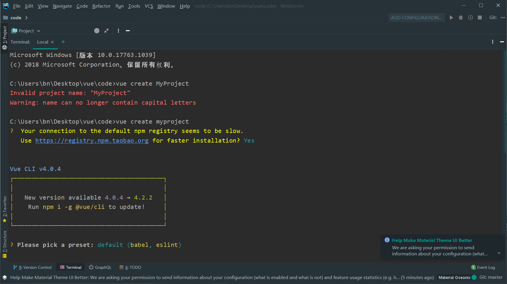


* 按键盘上下键可以选择默认（default）还是手动（Manually），如果选择default，一路回车执行下去就行了

* 如果是手动 

  注意，空格键是选中与取消，A键是全选
   TypeScript 支持使用 TypeScript 书写源码
   Progressive Web App (PWA) Support PWA 支持。
   Router 支持 vue-router 。
   Vuex 支持 vuex 。
   CSS Pre-processors 支持 CSS 预处理器。
   Linter / Formatter 支持代码风格检查和格式化。
   Unit Testing 支持单元测试。
   E2E Testing 支持 E2E 测试。

* 然后回车等待下载，尽量选择淘宝镜像 快一点

* ~~~
  cd myproject
  ~~~

* ~~~
  npm run serve
  ~~~

运行效果

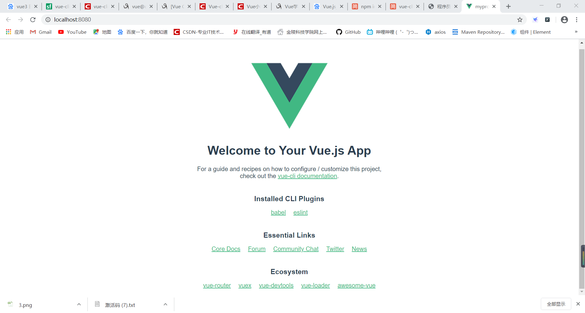

项目结构

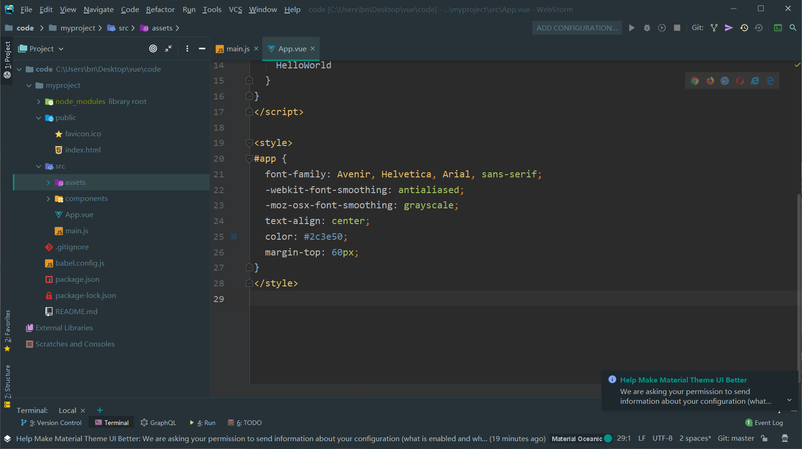


图片展示目录结构

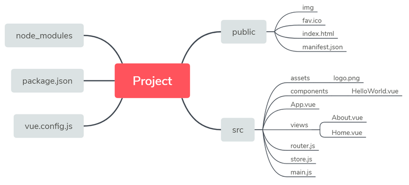


目录结构讲解

| 目录            | 作用                                                         |
| --------------- | ------------------------------------------------------------ |
| node_moules     | 存放的是npm加载的项目依赖模块 ，以后要添加依赖也是放在这个里面 |
| src             | assets：主要存放一些静态图片资源的目录。(css 等也可放在这里)<br/>views :放置的为公共组件(主要还是各个主要页面)<br/>components：(自定义功能组件)这里存放的是开发需要的的各种组件，各个组件联系在一起组成一个完整的项目。<br/>router：存放了项目路由文件。<br/>App.vue：是项目主(/根)组件，也是项目所有组件和路由的出口，之后它会被渲染到项目根目录的 <br/>index.html 中显示出来，我们可以在这里写一些适合全局的css样式。<br/>main.js：入口文件，引入了vue模块和app.vue组件以及路由router，我们需要在全局使用的一些东西也可以定义在这里面。store.js: 为vuex的文件 |
| public          | 它们会直接被复制到最终的打包目录（文件名需指定）下。必须使用绝对路径引用这些文件，简单说就是用来存放万年不变的文件。<br/>在vue2.x版本类似static/ 文件夹。 |
| babel.config.js | 项目配置                                                     |
| main.js         | 主文件入口                                                   |


****

**注意点**

~~~
npm install
~~~

是你在下载别人的项目时 git clone ，然后并没有依赖的js，css 等支持 。上面的步骤就不需要的，直接运行npm install ,然后 npm run serve

****


>  vue-cli3.0默认项目目录与2.0的相比，更加精简:
>
>  1. 移除的配置文件根目录下的，build和config等目录，
>  2. 移除了static文件夹，新增了public文件夹，并且index.html移动到public中。
>  3. 在src文件夹中新增了views文件夹，用于分类 试图组件 和 公共组件 。
>  4. 大部分配置 都集成到 vue.config.js这里,在项目根目录下


# 4. webpack

> https://www.webpackjs.com/concepts/


它做的事情是，分析你的项目结构，找到JavaScript模块以及其它的一些浏览器不能直接运行的拓展语言（Scss，TypeScript等），并将其转换和打包为合适的格式供浏览器使用。

## 4.1 使用理由

现在是网络时代，在我们的生活中网络成为了必不可少的，我们在网络上可以看到很多漂亮的功能丰富的页面，这些页面都是由复杂的JavaScript代码和各种依赖包组合形成的，那么这些都是怎么*组合在一起的呢，组合在一起需要花费多少精力呢，经过漫长发展时间现前端涌现出了很多实践方法来处理复杂的工作流程，让开发变得更加简便。

- 模块化 可以使复杂的程序细化成为各个小的文件
- 预处理器 可以对Scss，less等CSS预先进行处理

## 4.2 安装

+ 首先检查 

  ` npm -v`  检查安装工具的版本，是否安装成功

  `node -v` 检查是否安装成功node.js

+ 进行安装--两种方式

| 命令                                       | 作用                                                         |
| ------------------------------------------ | ------------------------------------------------------------ |
| npm install webpack -g<br>npm i -D webpack | 全局安装，安装一次，然后每次启动项目时，就不需要安装。       |
| npm install webpack --save-dev             | 局部安装，仅有此项目会有webpack工具，每次新建项目时都要重新安装一下 |

建议全局安装

**会有插曲--报错，原因是多次安装失败**

> Unexpected end of JSON input while parsing near。
>
> 运行下面命令即可
>
> ~~~
> npm cache clean --force
> ~~~
>

* webpack 4.0 以上吧 webpack-cli 和webpack 分开了

  ~~~
  npm i -D webpack-cli
  ~~~
  
* 安装成功检查
  ~~~
  webpack -v
  ~~~


## 4.3 入门使用

* 创建项目和文件夹

  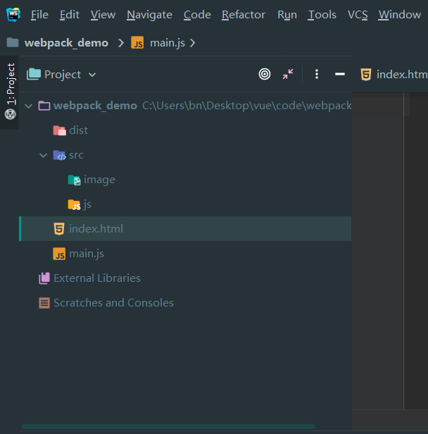


* 运行下面的命令

  `npm init`  ----**一路回车** ，会提示你包名，项目名，作者,最后会出现 package.json

  `npm install webpack -g` 安装 webpack ，如果已经安装过了就不需要重新安装了

* 在 src/js 下面创建 1.js

  main.js 内容

  ~~~js
  // 这个是主函数的入口，所有js 都需要通过 main.js 来实现
  console.log("这个是主函数的入口");
  const a1=10
  const a2=9
  
  const {add,sub}=require("./src/js/1")
  
  
  add(a1,a2)
  sub(a1,a2)
  ~~~

  1.js 内容

  ~~~js
  function add(num1,num2) {
      console.log("加法的入口")
      return num1+num2;
  }
  function sub(num1,num2) {
      return num1-num2;
  }
  
  module.exports={
      add,sub
  }
  ~~~

* 运行webpack 的打包命令 **-o 记得写**

  ~~~
  webpack ./main.js -o ./dist/kk.js
  ~~~

* 结果

​      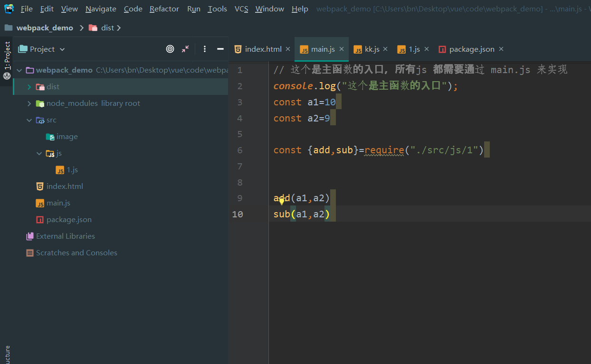


**注意点**

运行打包命令时，出现warning

~~~
webpack ./main.js -o ./dist/kk.js -build
~~~

或者

~~~
webpack ./main.js -o ./dist/kk.js --mode development
~~~


* index.html 使用

~~~html
<!DOCTYPE html>
<html lang="en">
<head>
    <meta charset="UTF-8">
    <meta name="viewport" content="width=device-width, initial-scale=1.0">
    <title>Document</title>
    <script src="dist/kk.js"></script>

</head>
<body>

<div id="app">
  <p>html</p>
</div>


<script>


</script>

</body>
</html>
~~~

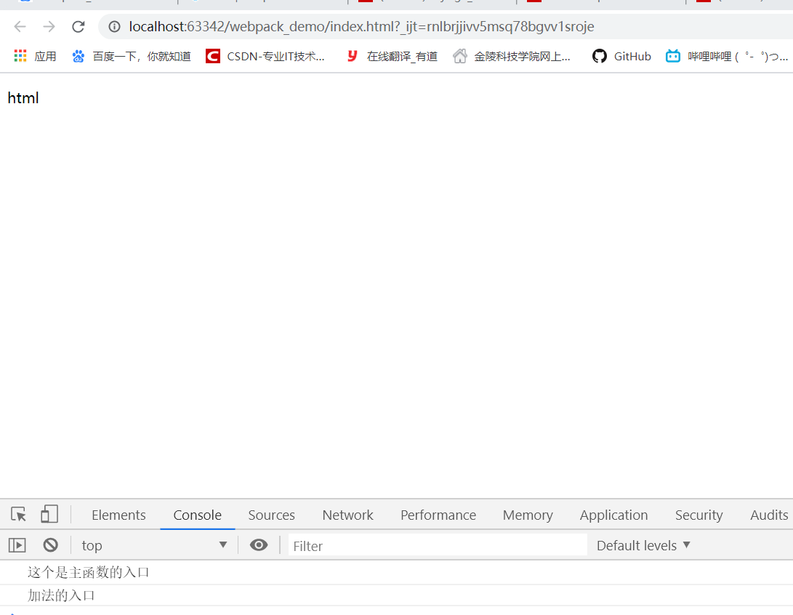


具体的打包命令展示 

> https://webpack.js.org/api/cli/


## 4.4 配置使用-webpack.config.js

如果不想每次都需要写 打包的js 和 出口文件，就需要 使用webpack.config.js

### 新建webpack.config.js

~~~js
const path = require("path")

module.exports = {

    // entry 就是主函数入口
    entry: "./main.js",
    // output 是输出路径，path是输出位置，filename是输出名字
    output: {
        path: path.resolve(__dirname, "dist"),
        filename: "kk.js"
    },

}
~~~

### 运行命令

~~~
webpack -build
~~~

或者

~~~
webpack --mode development
~~~


结果

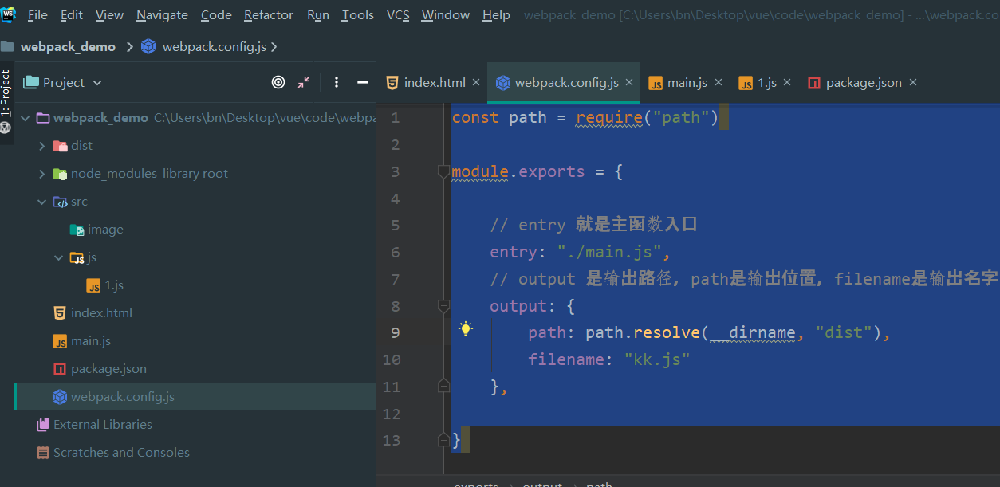


## 4.5 webpack-dev-server 使用

这个类似于SpringBoot 中的热部署，每次更改代码，都要自己运行 webpack --model development ,比较麻烦

所以开启热部署 ，就不需要每次都来运行命令了

###  4.5.1 本地安装

~~~
npm install webpack-dev-server --save-dev
~~~

### 4.5.2 修改package.json

~~~json
 "scripts": {
    "test": "echo \"Error: no test specified\" && exit 1",
    "dev": "webpack",
    "server": "webpack-dev-server"
  },
~~~

### 4.5.3 修改index.html

**重点修改 js 路径**

> webpack-dev-server 帮我们打包生成的 js ，并没有直接存放在 实际的物理地址上，而是直接托管到电脑的内存中，所以，我们写项目根目录根本找不到打包好的 js

~~~
<!DOCTYPE html>
<html lang="en">
<head>
    <meta charset="UTF-8">
    <meta name="viewport" content="width=device-width, initial-scale=1.0">
    <title>Document</title>
<!--    重点修改 js 路径，千万别要写 dist/kk.js ，不然的话修改 js 的话就不会成功-->
<!--    http://localhost:8080/kk.js-->
    <script src="kk.js"></script>

</head>
<body>

<div id="app">
  <p>html</p>
    sadsadqwqwq
    asdasdassssss
    asa

</div>


<script>


</script>

</body>
</html>
~~~


### 4.5.4 运行命令

~~~
npm run server
~~~

注意点 ，index.html 中应用的js 为 打包过后的js ,并不是main.js

然后修改js ，点击页面刷新，就可以发下结果


> 发生错误
> 就是删掉全部 的node_modules，说明安装包的时候出现错误
> 然后重新运行 

~~~
npm install
npm install webpack 
npm install webpack-cli
npm run serve
~~~
下面的是csdn 上我进行参考的文档
~~~
https://blog.csdn.net/qq_40241957/article/details/98937736
~~~

~~~
https://www.cnblogs.com/muxi0407/p/11833317.html
~~~

缺一不可，会报各种错误，检查package.json

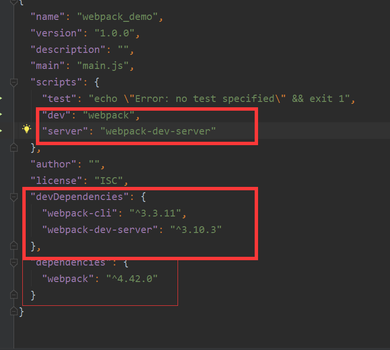


### 4.5.5 命令解释

在package.json 中

~~~
"server":"webpack-dev-server --open --port 3000 --contentBase src --hot "
~~~

--open 表示自动打开浏览器

--port 3000 表示打开端口 8000 

--hot 开启热部署

--contentBase 表示首页目录在 src 下面

### 4.5.6 第二种方式实现配置

修改webpack.config.js

~~~
devServer: {
    open: true,
    port: 3000,
    contentBase: "src",
    hot: true
  }
~~~

在4.0 以后，热部署只需要 hot:true即可


# 5. Element-UI

Vue的网页端框架

~~~
https://element.eleme.cn/#/zh-CN
~~~


# 6.Mint UI

Vue 移动端框架

~~~
https://www.w3cschool.cn/mintui/
~~~

